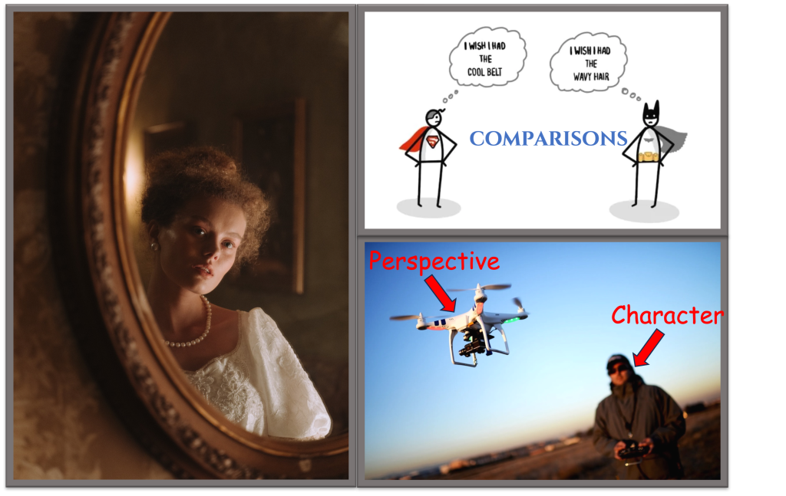
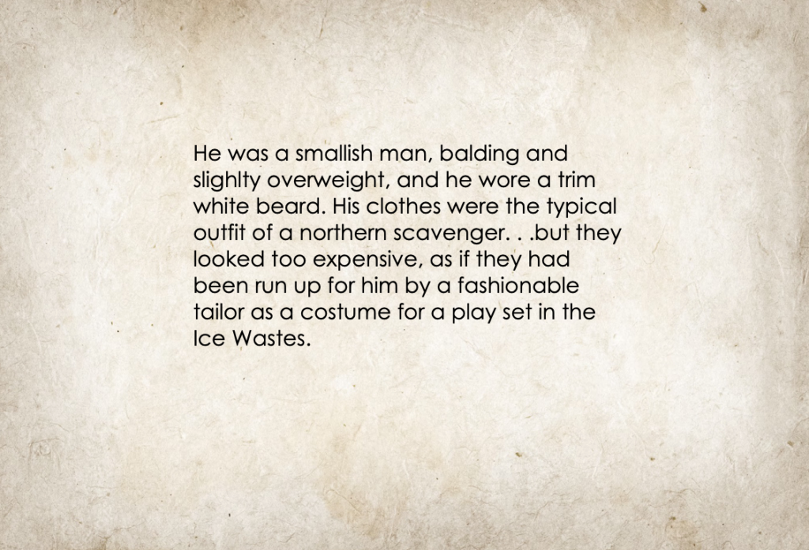
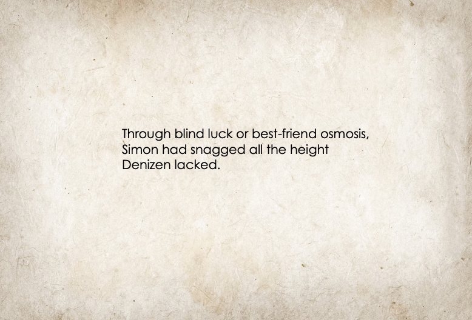
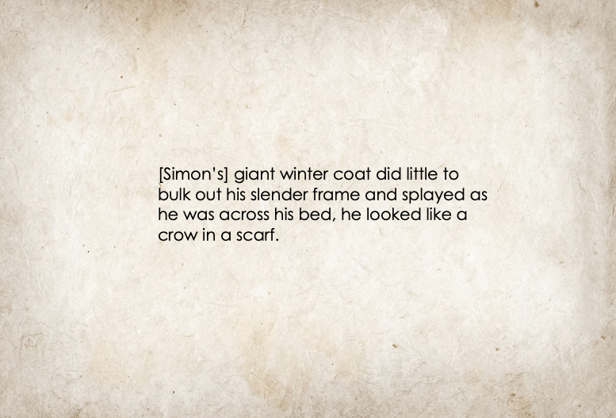
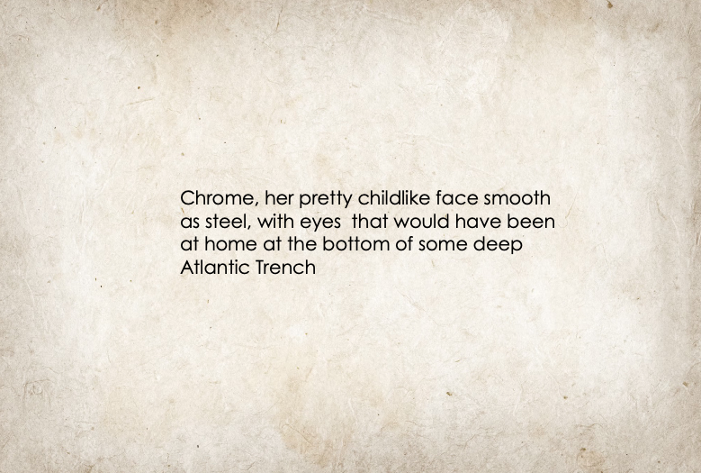

# 6 Tips to Enhance Character Descriptions

Date: 2023-07-25 13:52:37

Character descriptions. Sometimes epic, sometimes fascinating, sometimes just plainly necessary.

I used to be really bad at this, so I’m going to share some tips to help you improve your character descriptions and get to the really interesting parts of your writing. Not that character descriptions can’t be interesting, but I will confess I prefer writing heartbreak and action to descriptions. So, without further ado, let’s get straight into it!

Quick disclaimer: These tips are for relatively important characters. For unimportant characters, or characters that are only important for one chapter or so, you can describe them with a simple: gender, occupation, one trait. Example: “He was led through the room by a man who was strangely old to be waiting tables”. You can leave it at that, or even less, whenever it’s necessary.

Another quick thing I would like to mention is that the way you apply these tips is going to vary person to person. If you’ve got more of an omniscient third person or a narrator, you can just describe characters on the spot, but if you’re using first person or a very tight third person perspective, you may need to use reflections, comparisons, or memories to provide those descriptions.

* * *

**Start with the who**

Before you get too far into describing what your character _looks_  like, you as the writer have to know who the character _is_. This doesn’t have to be as detailed as some people suggest. You don’t need to know the way your character ties their shoelaces, what football team they support, what their favourite colour is, etc. You just need to have a good enough idea of this character to be able to get inside their head and understand their motivations, how they would like to appear to the world, and how circumstances affect that.

This helps tremendously with character descriptions and the characterisation that can be achieved through it. You know this person is practical, so they wear functional clothing and cut their hair short. You know this other character loves sports, so they’re wearing sneakers even at a more formal event. They want to project confidence, so they keep themselves clean, even in terrible conditions. You know this person couldn’t give a donkey’s ass, so they walk around with crazy text on their t-shirt like Mad Sweeney in American Gods, for example.

So before you start describing, start with knowing who your character is.

**Forget About Eye Colour (Unless you’ve got a good reason)**

It can be so easy to describe characters as [eye colour], [hair colour], because these are simple traits that can be easily described.

Resist the temptation. It is far, _far_  more effective to focus on their clothes, the shape of their face, etc. I want to hear about how their brow seemed permanently furrowed beneath the brim of their trodden-down, wide-brimmed hat, not that their sight-orbs were the blue of fish-scales. Please.

You can even use these more interesting descriptions to do a little bit of worldbuilding.

A quick example of such a description, tying in the previous tip as well, comes from  _Predators Gold_ by Philip Reeve:

However, sometimes there are reasons to highlight eye colour, for example, in _The Lies of Locke Lamora_  by Scott Lynch, Locke’s eyes are mentioned because they contrast to the rest of him:

**Use Comparisons With Other Characters**

Always remember that your characters don’t exist in isolation. They are all comparable to the characters around them. This is especially important for point-of-view (PoV) characters. Are they taller or shorter than another character? Do they wish they had another character’s beautiful hair or air of confidence. These are all questions that, when answered, can help describe, not only your PoV characters, but the other characters too, and can give us an insight into the characters’ minds.

An amusing example of using comparisons can be found in  _Knights of the Borrowed Dark_ by Dave Rudden:

**Use Similes to Enhance Descriptions**

Similes are extraordinarily helpful in descriptions, breathing life into your scenes, and they can do the same for characters, or just simply make their appearances seem more interesting. Because I’m a man of convenience, I will use the next sentence of Dave Rudden’s description from the previous point to outline the effectiveness of using similes:

But because that feels cheap, I will also give another example from  _Burning Chrome_ by William Gibson:

**Use Memories**

If your PoV character knows the person you’re describing (or if it’s them), you can compare what they look like now to what they looked like in the past, to give us a deeper insight. Alternatively, you can use those memories to elaborate on certain descriptions. And it looks like I forgot to find an example for this, but you know where I’m coming from. It’s the same deal as using comparisons with other characters.

**Descriptions Aren’t Essential**

Does this run counter to everything I just said? Perhaps, but I will stand by it. Character descriptions aren’t everything. It is far, _far_  more important that the character feels alive, has a personality, and is interesting.

This is especially important to recognise for your PoV characters, who it can be more difficult to describe in certain stories, without breaking immersion or flow. Neil Gaiman demonstrates this in his novel  _American Gods_. In it, the main character, Shadow, is only ever described as big, tall, and having an ambiguous racial appearance. In fact, the main description we get of Shadow is in the second sentence of the book and lacks any vividity at all. However, it does give us implications of his personality, which we learn so much about over the course of the novel:

This simply serves to illustrate that character descriptions aren’t completely necessary. As readers, we fill in the blanks of what we think the character might look like and still relate to the characters because they feel  _alive_. I think this is a good place to end this post, as it serves to reinforce the first point I discussed: start with the who.

* * *

If you enjoyed this blog post, found it helpful, or would like to see more of this kind of content, be sure to like the post, share it, and subscribe. Good luck describing (or not describing) your characters!

ETM Collins
