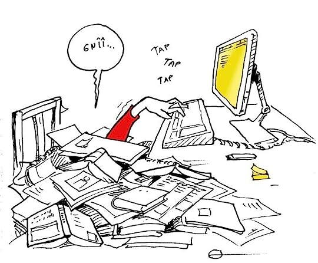
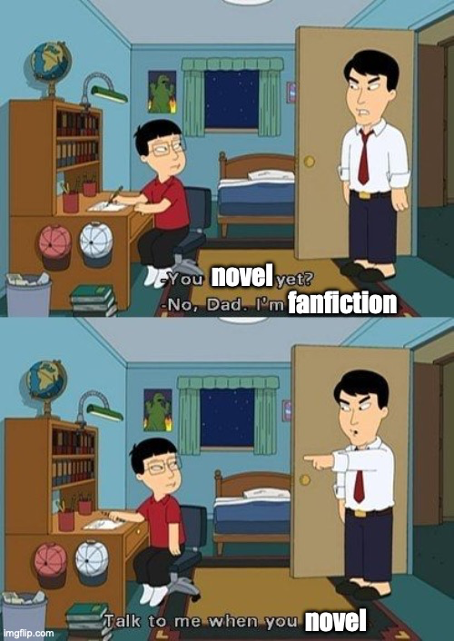
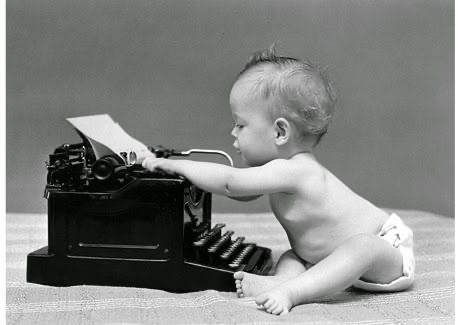
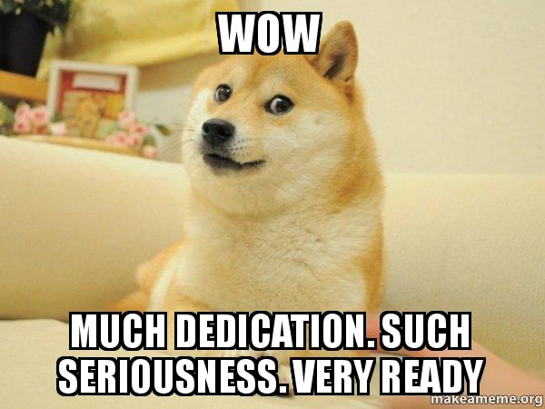

# How NOT to Write a Novel

Date: 2023-07-07 20:11:06

I pride myself on my writing. I’m certainly not the best writer out there, but I have practiced for thousands of hours and I have the dedication to finish the projects I start. However, this dedication hasn’t always worked to my advantage and while I’m happy with the time I’ve invested into writing  _King of Ash_. So, without further ado, here are 5 things I did that you shouldn’t do if you are writing a book.

**1\. Do no research on writing**

When I was first writing _King of Ash_ , over six years ago, I just sat down at the computer and started writing. And that is great. Only problem is, I had decided that I wanted to write a full book. Now, I read a lot, so I was pretty sure I knew how I would go about this. I had a vague idea and the spirit to write it. However, with SO MUCH ADVICE online (like there is a mountain of advice), it is well worthwhile to get the advice of authors who have been through the processes and who have studied this stuff and who have wisdom to impart. Hell, even have a skim through the blog of some unpublished author telling you what not to do 🙃.

This lack of knowledge and research made it so that I had to learn _so much_  of plot structure, pacing, tension, and worldbuilding by experience or inference, and boy is that a rough ride. In fact, I think it was part of the reason why I would often go months without writing in the early days.

**2\. Research writing too much**

Source: MICHÈLE LAFRAMBOISE'S BLOG, Goodreads

Okay, so this is kind of contradictory to my first point, but trust me. As with all things, there is a balance to be struck in the amount of research you do. Don’t go blind into a big project, but similarly, don’t do what I later did, and consume _too much_  writing advice. 

Firstly, it’s a great way to procrastinate. Do you know how many hours you can sink into something that’s “helping”. Yeah, it’s way too many.

Secondly, writing is an art and while there are rules most things follow, you don’t always have to follow those rules. As well as this, there aren’t as many rules as some people pretend. You _really_  don’t need to know the exchange rates of various currencies in your world. Nor do you need to have complex character sheets with your character’s top fifty favourite tv shows (I don’t think I could even list my _own_  top fifty tv shows!).

So, while research is helpful for writing, too much research can make you feel overwhelmed, innadequate, unmotivated, or can just delay your progress. Also, take everything you read, watch, listen to, or obtain by osmosis, with a pinch of salt, even this very blog post.

To temper this point, I would like to just quickly tell you that despite the helpfulness of doing some research and the fact that I would have benefitted from more research earlier on, the best way to learn writing, as with any art-form is by doing. So get out there and start writing!

**3\. Think that your writing  _has_  to be a novel**

This is just blatantly untrue, especially when you’re writing seriously for the first time. If you’re learning, I would heartily recommend short stories, fanfiction, and random opening chapters for works that will never and never need to be finished. These are all great ways to dip your toes in the water and get some experience. I think I would have enjoyed my early days of writing much more had I not been stuck in the mindset that the stuff I’m writing “has to be a novel”, that it has to be this long and everything has to be connected and blah blah blah.

Writing a novel is a big commitment and I certainly wouldn’t recommend it as your first experiment with writing. At the end of the day, creation should be enjoyable, and I spent far too long simply frustrated by trying to do something I wasn’t ready for.

**4\. Start writing longform when you’re very young**

Source: Promita, Steemit

We all grow and change as people throughout our lives, and as we grow our preferences change, along with our beliefs and personalities. This is why trying to write longform fiction when you’re very young (as I did) is a bad idea. The younger we are, the faster we change. Often I would reach the end of a draft only to want to change it because my idea of what a “good story” was had changed.

Writing when you’re young is great and I would encourage young people everywhere to learn to write, or paint, or sing, or sculpt. Having a creative outlet is crucial for your development as a person. However, if the thing you are creating takes a long time to make, be aware that your opinions of it may have changed by the time you’ve finished.

Or, if you must write an epic when you are but a wee tot, I would recommend writing it for a younger audience than yourself (weeer tots?), to mitigate the impact of your changing personality and preferences.

**5\. Dedicate yourself to one project**

Oh boy, this is a big one. If you’re still reading, then you’re getting dessert now, after your supper of the first four antitips. I did this with _King of Ash_ , or with what _King of Ash_  became, at least, and it was a mistake. I know this now and I have learned so much from the process of developing _King of Ash_  into what it is today, but steadfast dedication to the project was not a great idea.

When I was writing I would often fall prey to what is known as the Sunk-Cost Fallacy. There were many times that I wanted to change what I was writing, or move to another project, but I stayed because I’d already invested so much time into my current project and it would be a shame to abandon it now. I had thoughts like this halfway into my second draft. Now, while I often say _King of Ash_  was a nine-draft book (although most of those drafts involved complete rewrites because of tip 4 and 1), that is because I start counting at the point when the story is recognisable. If you include all the drafts before that, which slowly morphed into _King of Ash_ , I believe the rewrite counter is closer to 12.

To let that sink in, I thought that I was too close to the end to stop when I was on my 2nd rewrite, which was a third of the length my 12th. I could have written 12 different books. Indeed, I probably did end up writing a couple different books. It was just a much slower, more painful process because I didn’t simply accept that sometimes it’s a good idea to switch projects, especially when you’re less experienced.

Now, at the same time, I know people who bounce from idea to idea, never finishing a project, and that’s not ideal either. I admire everyone who manages to bring a novel from an idea to a rubbish first draft to a manuscript they are truly happy with, and I’m very proud of myself for my accomplishments in that area. However, bear this in mind before you get caught in the same mindset I did.

Now remember, everyone. Follow the five tips above and I will assure you you’ll have a more painful writing experience. Please do so, I need people to share in my pain. (I’m joking, of course. The beauty of the written work is that we can learn from each other, so please do that and have a good day).

Anyway, I need to neglect research while simultaneously researching too much, turn this blog post into a novel while being 5 years old, and dedicate myself to that project until I’m old and grey. Adiós.

ETM Collins
