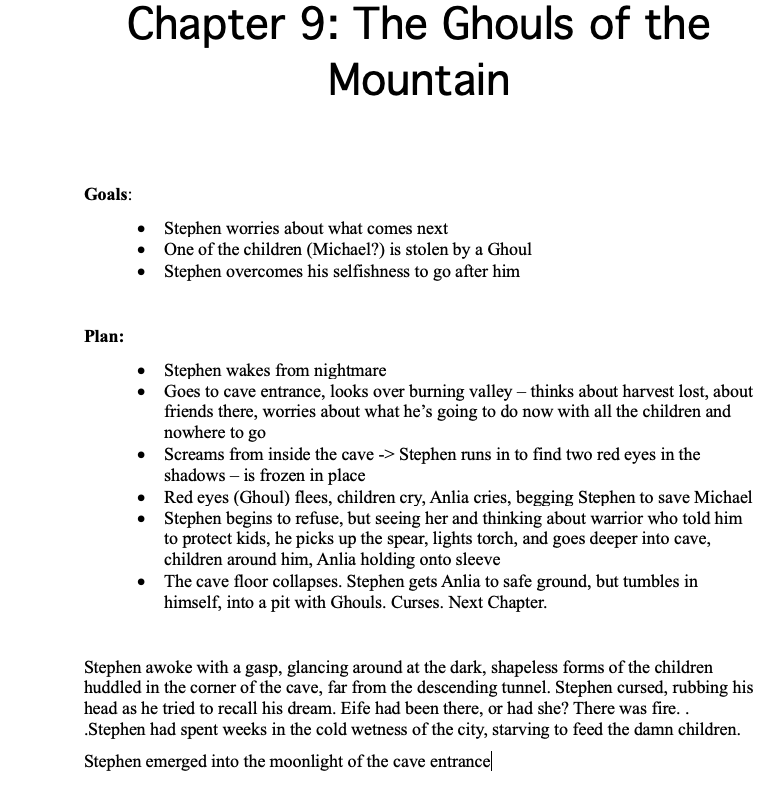

# How to Write Easy Chapters!

Date: 2023-07-10 15:51:28

We’ve all been there. Computer on, Word opened, staring at the blank page where we’re supposed to write our chapter, unsure of what exactly to do. 

Well, while that’s always a problem to some extent, this method will help to make chapter-writing just a little bit more of a breeze. So, without further ado, let’s dig into this.

## Step 1.

Goals. We need goals. So pull out the bullet points and get to work.

I like to put these goals under two headings, PLOT and CHARACTER.

PLOT contains anything that moves the overarching story forward. Does something catastrophic happen? Do we get closer to the Holy Grail? Does the main character get a new ability? The kingdom is invaded? Your characters plan a heist? All of these go into the PLOT category.

CHARACTER contains your character development/interaction. Do two of your characters have a terrible argument? Does one of your characters realise how much it would hurt to lose another character? Does a character get jealous of another one? These go under the CHARACTER category.

Now, these categories can and frequently do overlap, but it’s good to bear them in mind. I generally find that a chapter feels off unless I have at least one PLOT and one CHARACTER goal in it. This took me a while to learn, as I used to always focus too much on my plot goals, but I’ve found this method helps focus my writing and make it more interesting.

## Step 2.

Plan. 

Now, this might not suit everyone, but once I have a vague idea of what’s going on in the chapter, I like to lay out the events that need to happen. These are sometimes densely packed, as is often the case in character/dialogue-heavy chapters, whereas sometimes there’s only a handful of bullet points as is the case in more action-packed scenes. However, this may be different for you, and you may need to plan out your fight-scenes in meticulous detail and wing your character moments. I’m sharing my personal method, but you should experiment and find what works for you.

Here's a quick example of what my plan might look like:

  * Stephen wakes from prev. chapter’s nightmare
  * Gets up in the darkness and looks out over the fires in valley below
  * There’s a scream from within the cave
  * Stephen runs in sees red eyes in shadow over children. . .

And so on

## Step 3.

Write.

This is my favourite part, and doing steps 1 and 2 make the process a lot more streamlined. I look between my plan, my goals, and my writing to make sure that I’m doing what I need to do, although I _do_  often make mid-writing changes, but even those feel better after going through this method.

In essence, this is what my method looks like when I’ve started this step:

I urge you to test out this method and let me know how it goes for you. And if you have any methods you use to streamline your own writing, please let me know!

ETM Collins
