# Let’s Write A Book: Characters

Date: 2023-08-01 16:03:57

What's up everybody?

I’ve got something good for you now. I’m going to be writing a story with all of you and walking you through the process. Step by step. I will show you the thought processes and methods I use at each point in this journey, giving you a really close up look at the creative process.

In this post we’re going to start with a premise and over the course of several posts we’re going to write and develop an impressive story. Make sure you read the whole thing, because I will show you all the steps needed to make a brilliant narrative and we won't stop until we have made something beautiful. Without further ado, let's dig into this!

Okay, here’s the idea, to begin with:

**2 POV characters:**

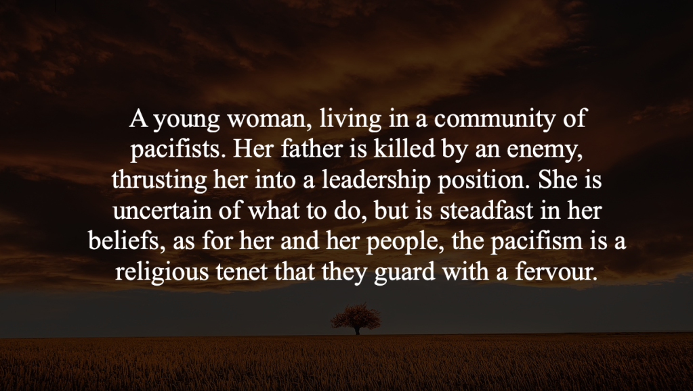 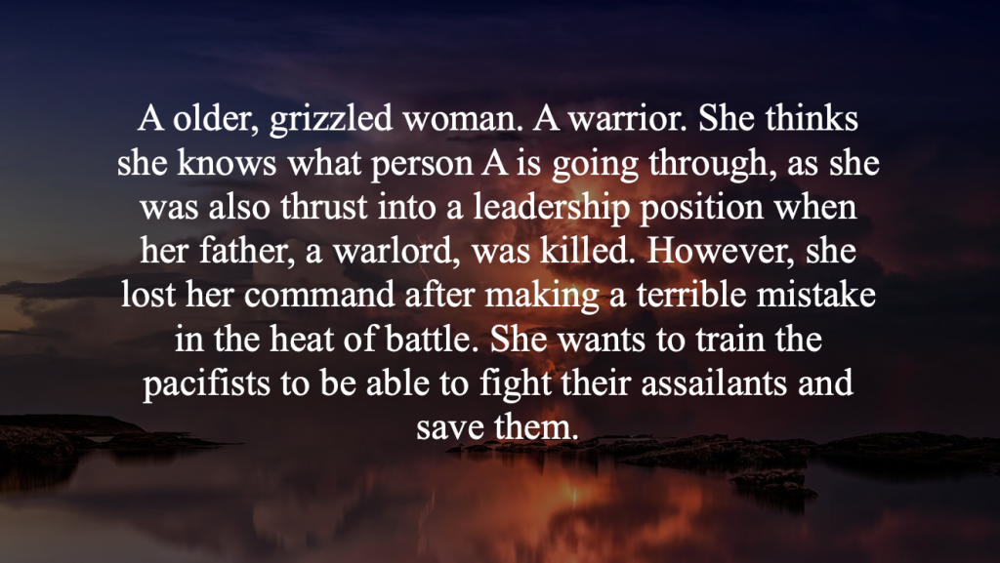

There will be a battle of wills. Some pacifists will become warriors, some will stand by person A. In the end, we will end with a poem, as the pacifists are killed by the enemy. The poem was said at the start, but is given context by the events of the story. Woman B will either die trying to protect them or mourn them. Neither woman is right, neither is wrong. They both lived life and learned from each other. They both doubt themselves, but hold to their beliefs. This is a story, but not a fable.

The story will probably change later, but it’s what we have for now, boiled down to its essentials. It’s probably worth mentioning that this is a fantasy story and will have worldbuilding and magic, so stay tuned for that.

But how did I come up with this?

Well, sometimes I like to browse Pinterest, looking at art and pictures of nature. Sometimes I like to just let my mind drift. Other times, writing prompts or elements of stories I’m reading can help produce an idea. However, my biggest tip for coming up with great story ideas is this:

Get a notebook. A real, physical notebook. Not your phone or laptop or anything like that. A real notebook. A cheap one, but one that feels nice to write in. Find one that works for you. I personally don’t like ones with lined paper or detailed covers, but everyone is different.

Next, when you’ve got that notebook, whenever you daydream or an idea occurs to you in whatever mushy, half-baked form it comes, write it down. The act of writing down the idea helps solidify it in your mind, and allows it to develop into something interesting.

Sometimes this solidification gives you a full story. Other times you’ll need to take a character from last week, a world from three months ago, and a plot you’ve just come up with. Either way, the act of writing down your ideas is more effective for generating brilliant ideas than anything else.

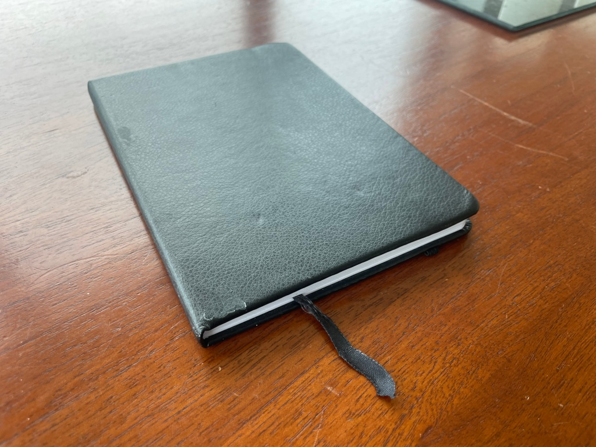 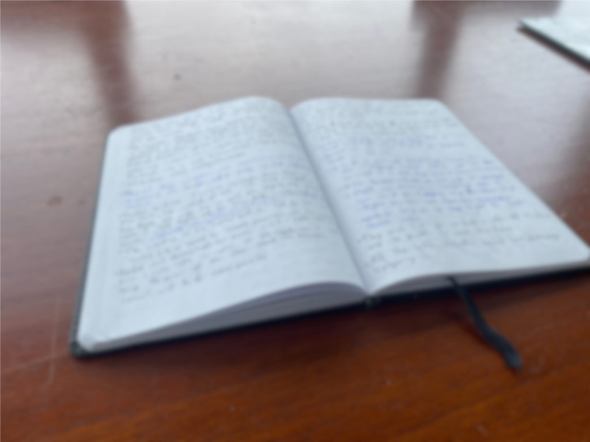

This is my notebook. It’s filled with ideas. Some link, some don’t. It’s a bit of a mess, but that doesn’t really matter, because aside from names, dates, and other specifics, writing down the ideas and plots means I don’t forget them and they can continue to develop in my mind, not simply vanishing as ideas do.

Anyway, back to our story. Time to make the characters.

**Step 1. Names, descriptions, and personalities**

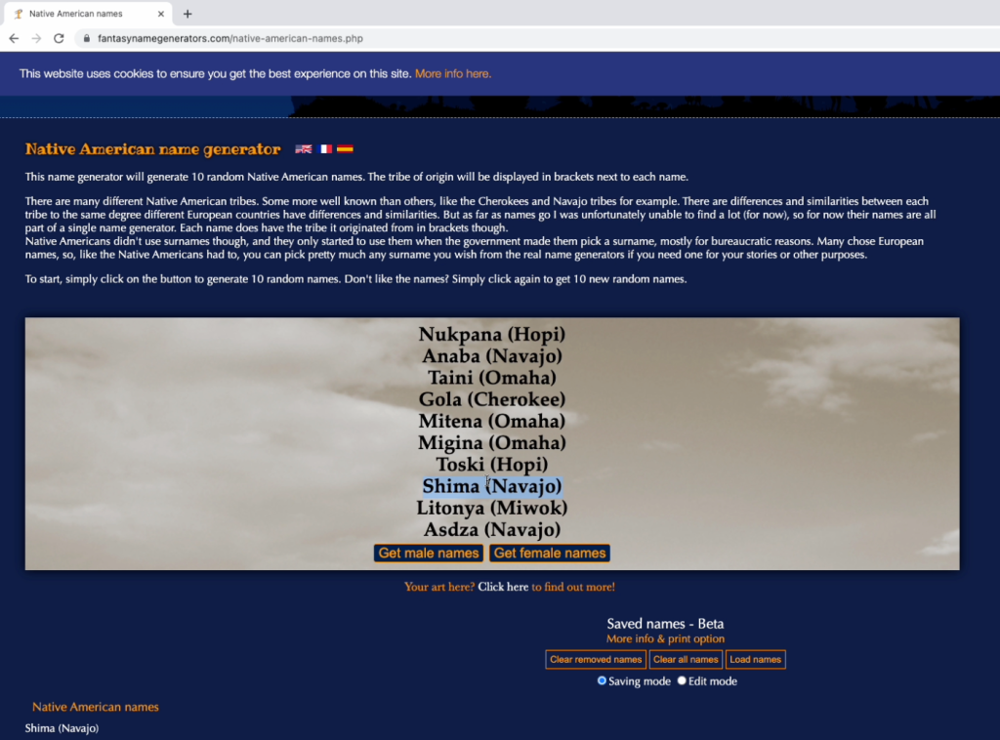

I’ll use two different methods for the names. The first, for woman A, will be [fantasynamegenerators.com](https://www.fantasynamegenerators.com/).

And from this, we got “Shima” (She-muh), a Navajo name which means mother, but the meaning isn’t super relevant for this story, as it’s set in a fantastical world where America doesn’t exist.

For woman B, I will use ol’ reliable:

**Keyboard smash:**

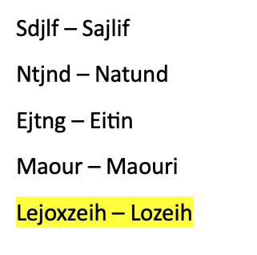

As you can see from my examples, it doesn’t always give a great name, but I like the name Lozeih, which we can simplify to Lozei (low-zay).

Next, we’ll get some descriptions and personalities. For these I’m mixing two things. 

The first is I’m taking the general image of the character that has developed in my mind and trying to transfer that to a description. 

The other thing I’m doing is going on google and looking up certain ideas. Certain groups of people, certain appearances, and trying to work those into what I’m writing, taking a moment to sit there and imagine what the character would look like. 

Another technique that I sometimes use is looking up a bunch of traits, articles of clothing, and emotions and make tab groups so I can flick between the different characteristics of a character and see what fits and what doesn’t. 

And finally, taking traits from people you know in real life can be handy too.

I like to make my characters seem interesting from the get-go, whether that’s with unique descriptions, personalities, or hobbies. I hope I’ve achieved that here.

* * *

Shima:

**Physical:**

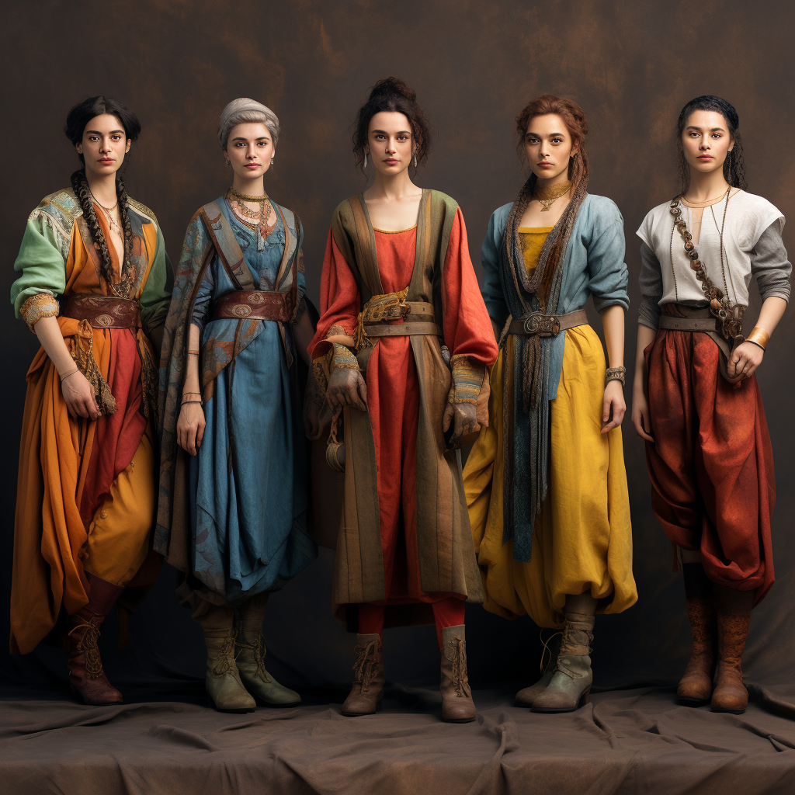

Clothes would be a bit like this

I’m imagining Shima as having light-brown skin and braided hair that goes from blonde at the ends to a darker brown than her skin at the roots – naturally, of course, as it’s fantasy.  to She is a little short, but when she feels passionate about something, she projects the presence of someone twice her size. She wears a pearl ring on her right hand (which is missing a finger from a childhood accident, and calloused from physical work), and fidgets with the ring when nervous. She generally wears colourful, layered clothes, generally a blouse and wide trousers, which is the norm for most members of the community, both male and female.

**Personality:**

She is witty, when comfortable, and though she’s uncomfortable speaking before people, she forces herself to work as hard as she can to take her father’s place. She is also angry. No serene pacifist. She hates the people that killed her father and hates her god for being so unfair, while loving it at the same time. However, this hate and anger only makes her cling to her religion and morals more vehemently.

* * *

Lozei

Physical:

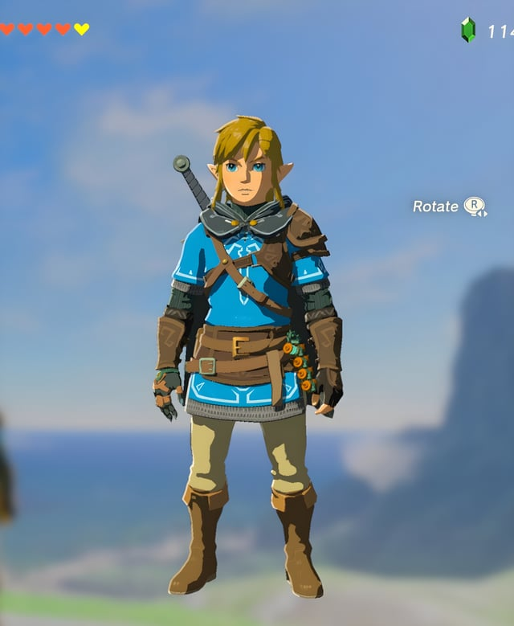

Lozei is an imposing figure. Big, well built, certainly a match for most of the men who once served under her command. She keeps her black hair short. Her skin is a little darker than Shima’s. She wears a dark sturdy linen shirt with leather bracers, a belt, and a shoulder belt (a baldric for those versed in such terms), along with sturdy trousers and worn boots. Actually, her outfit looks a little like link’s here, but in a dark green or something.

Personality:

Lozei may seem like a rock, but she is just straining to protect the people around her, sometimes to a fault. She speaks gruffly, but get her drunk or tell a good joke, and you’ll hear a laugh heartier than any other. She also has a soft spot for animals, and while she eats meat, she says a prayer for the animal before eating.

* * *

With the descriptions out of the way, I thought I’d get some images to accompany. I don’t usually do this, but here we go. (Images were attained using Midjourney as I don’t have the budget for an artist, nor the skill to do it myself).

Lozei is on the left, Shima on the right. I had to manually edit Lozei and she still doesn't look as old as I'd like, but it'll do for now.

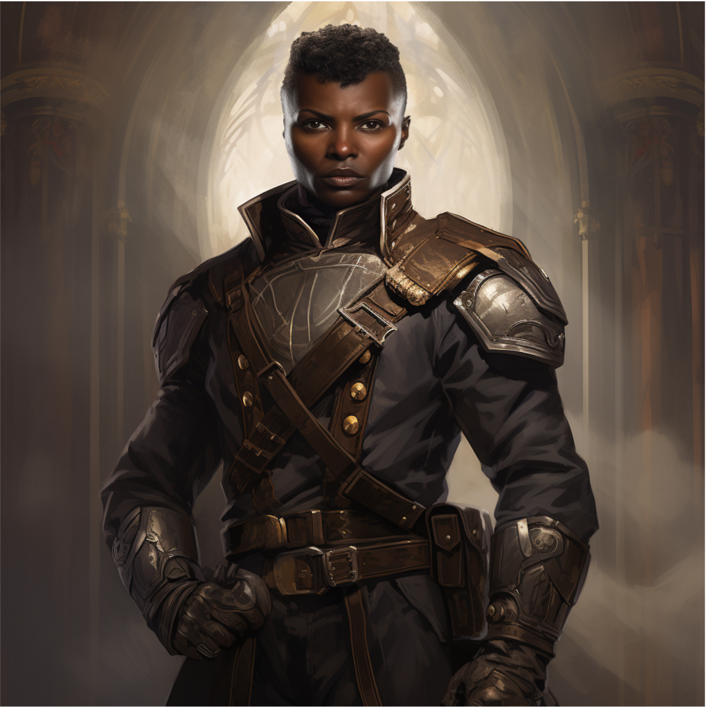**Lozei** 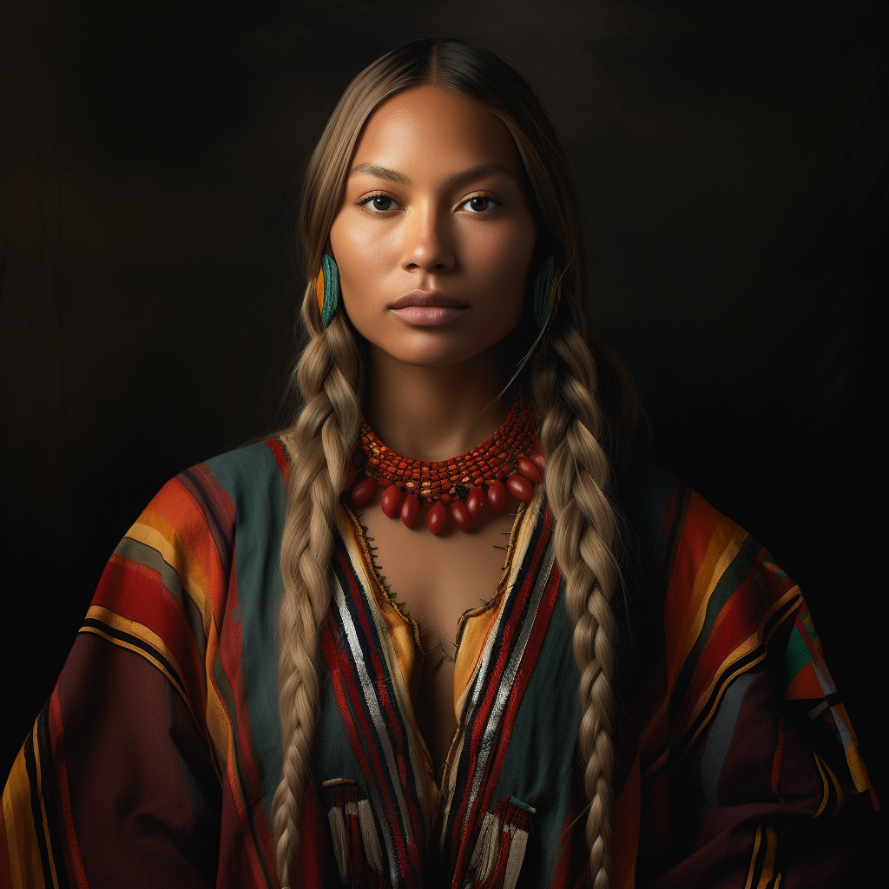**Shima**

**Step 2. Relationships**

A lot of people will tell you that relationships are all about emotions and that kind of mushy stuff.

They’re lying to you.

Relationships are about logic. Cold, hard logic. And that’s how I like to approach character relationships.

Okay, I’m exaggerating a little bit, but there is a lot of logic to building character relationships. Shima is lovely and lives in a community and stuff, so she’s friends with loads of people, whereas talking to Lozei is like talking to a wall (minor exaggeration). Because of this, she has fewer close relationships. However, there’s a bit more to it than that. Think of how and why certain relationships would develop. This helps deepen and develop your characters into people who feel real. Also, consider the plot. Do you need people to die? Do you need someone to open up from being an icy fortress? These all inform the way you build your relationships.

It's kind of like this:

* * *

**Lozei** is a bit of a lone wolf, (comes from the whole macho warrior thing) although she does have her loyal steed, Arit (the whole soft spot for animals thing), meaning “Wings” in this world’s equivalent of Latin. Let’s give him a picture, because he’s a cutie pie:

Credit: Country-Living Magazine

Look at that beautiful hair!

* * *

Shima, on the other hand, is part of a large, diverse community, so her relationships won’t get images or descriptions, because otherwise we’d be here all day. You can read the descriptions when the story starts being written. Her relationships include:

Her father (deceased) – Arfa

  * He was a kind, gentle man, who had to raise Shima without a partner, although he had help from the community, especially the priest and his sister

  * He taught Shima most things she knows, from farming, to foraging, to reading the weather, to navigating

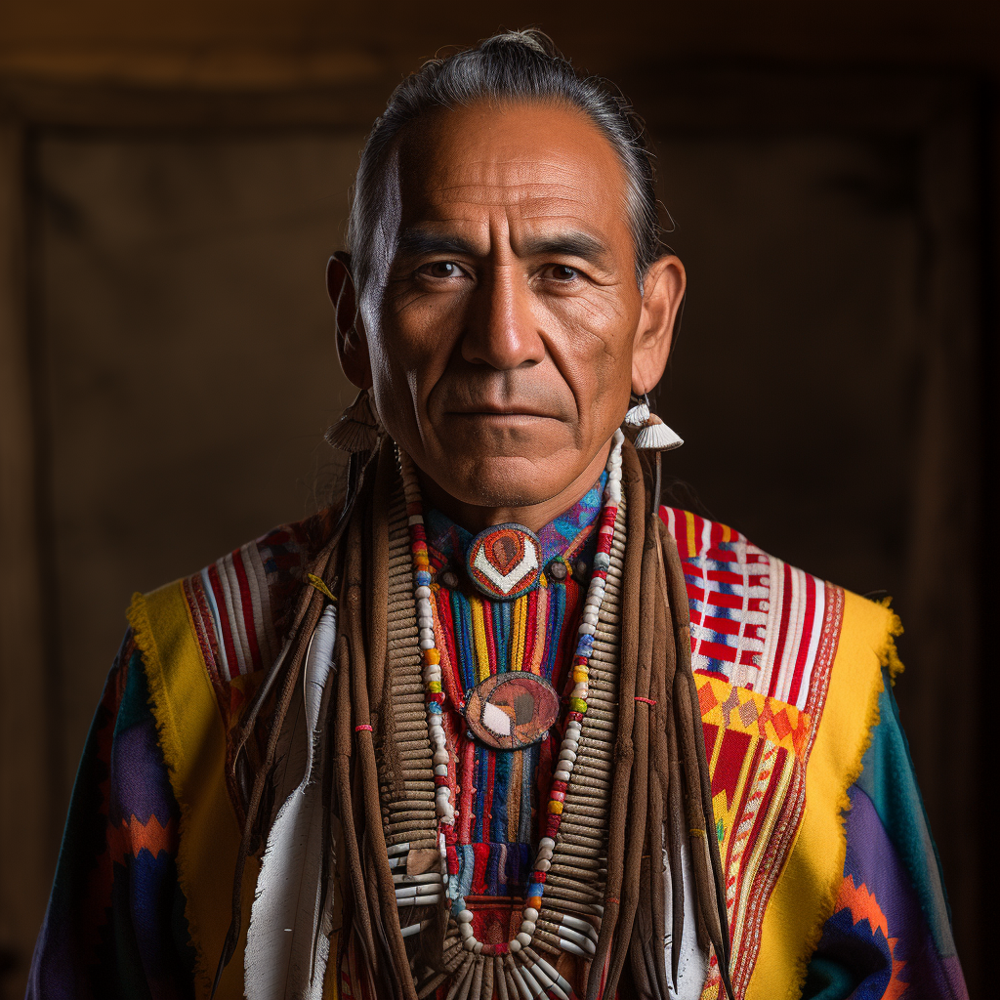

  * Her best friend – Ahurai
    * Shima has a crush on Ahurai. They used to play silly pranks on the priest and many of the other community members
  *     * Ahurai has always struggled to remain peaceful, with her anger always being more violent than most
    * She was taken in by the community after her parents died of a fever
    * Taught Shima basic first aid, and instilled a firm belief in their religion

The Priest - Venchi

  * A stern man, disapproving of change
  * He always has a lecture to counter a joke
  * He is earnest and wants to help people. That’s why he learns medicine from everyone who passes through the community. He also left once, to apprentice to a doctor

  * Taught Shima basic first aid, and instilled a firm belief in their religion

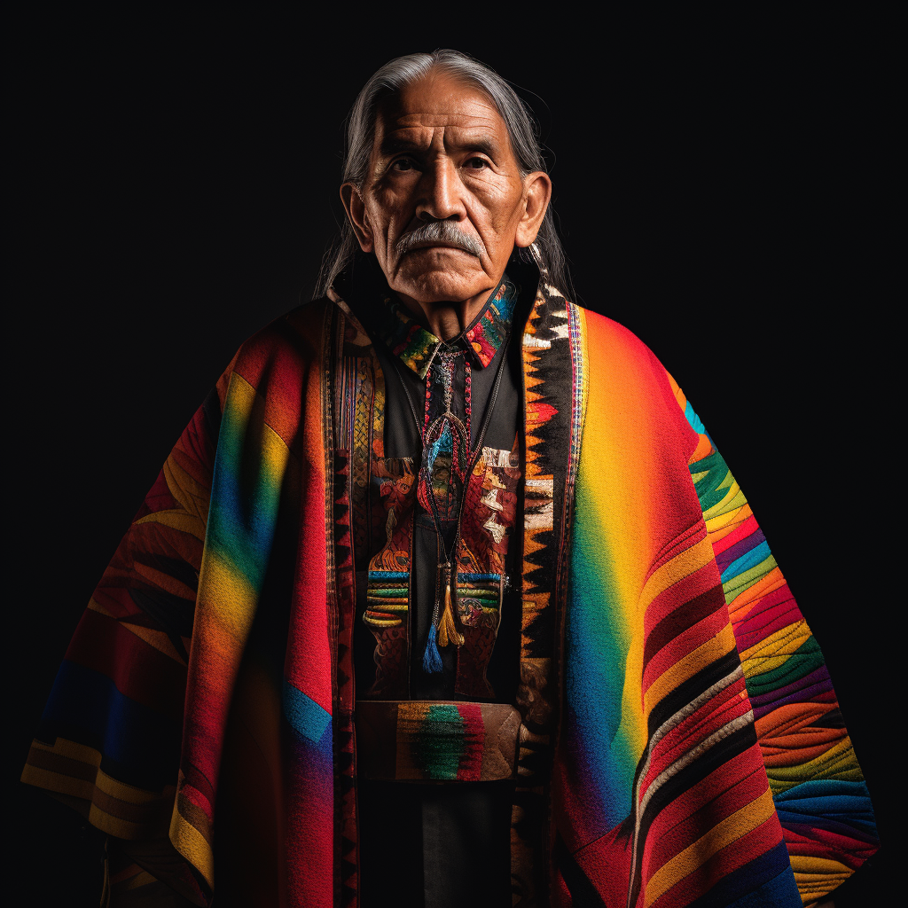

Her aunt – Malgua

  * Mother of six
  * No nonsense, but very caring
  * Incredible cook, although she doesn’t often get time to make what she’d like to

  * Taught Shima to sew and weave

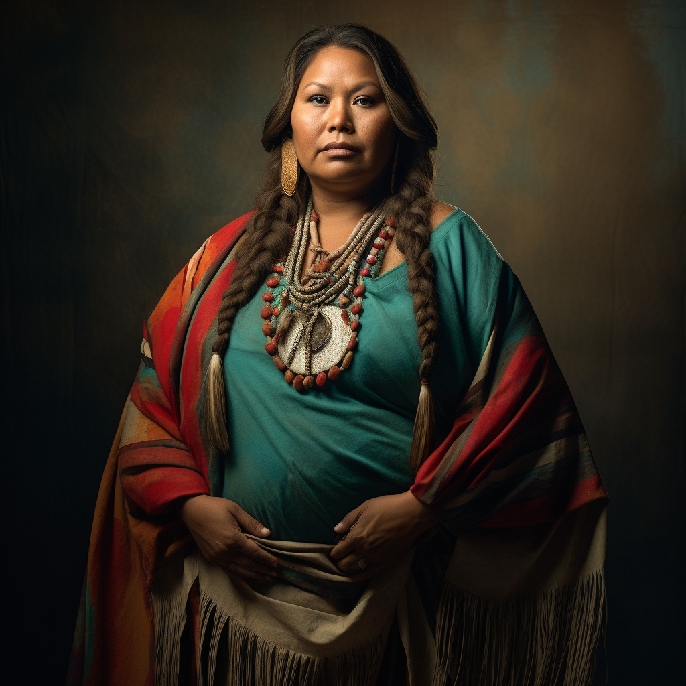

* * *

**Step 3. Goals**

We kind of set this up already, but we should lay these out clearly in order to get a better picture of what we’re doing. Goals are formed from a mixture of the idea-farming we did earlier and a little bit of logic now. Also, make sure to expand a little on who your character is with these. Give them some depth and some room to grow.

**Shima:** Protect her people and land, as long as it follows her religion, because for her people that is the most important thing in their lives. However, she cares for them. Cares so much she cries at night from the pressure and how scary it is to be fighting people with powerful weapons and magic when they can’t fight back.

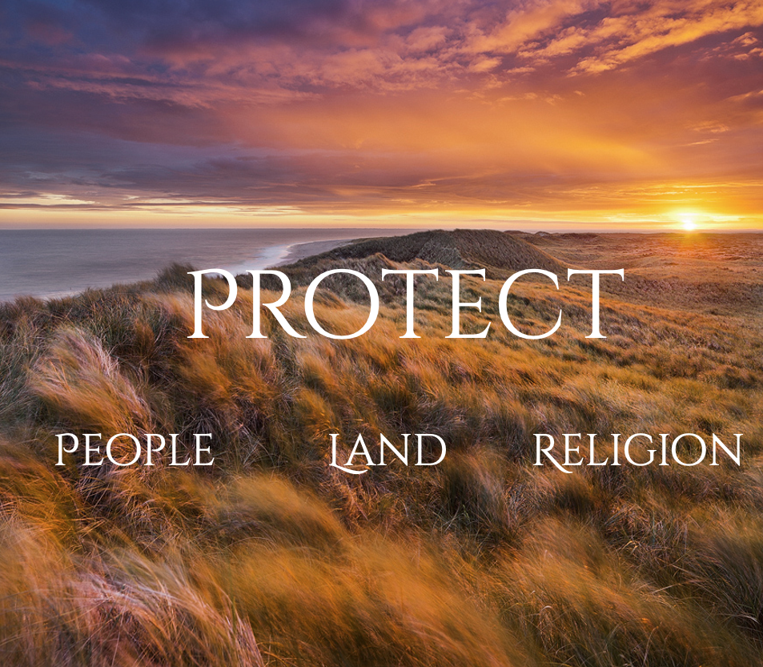Credit: [RAINER MIRAU](http://www.naturehighlights.com/author/rainer-mirau/) at Nature Highlights

This is the big goal, although she will have more laid along the story. That’s plot.

**Lozei:** Redeem herself. Recover her honour and prove that she can win battles, even with the worst soldiers possible. However, as she gets to know Shima and her people, her goals become more personal. She can’t let these people die. She has to show them that they have what it takes to survive and has to make them stand up for themselves. This is more important than any honour.

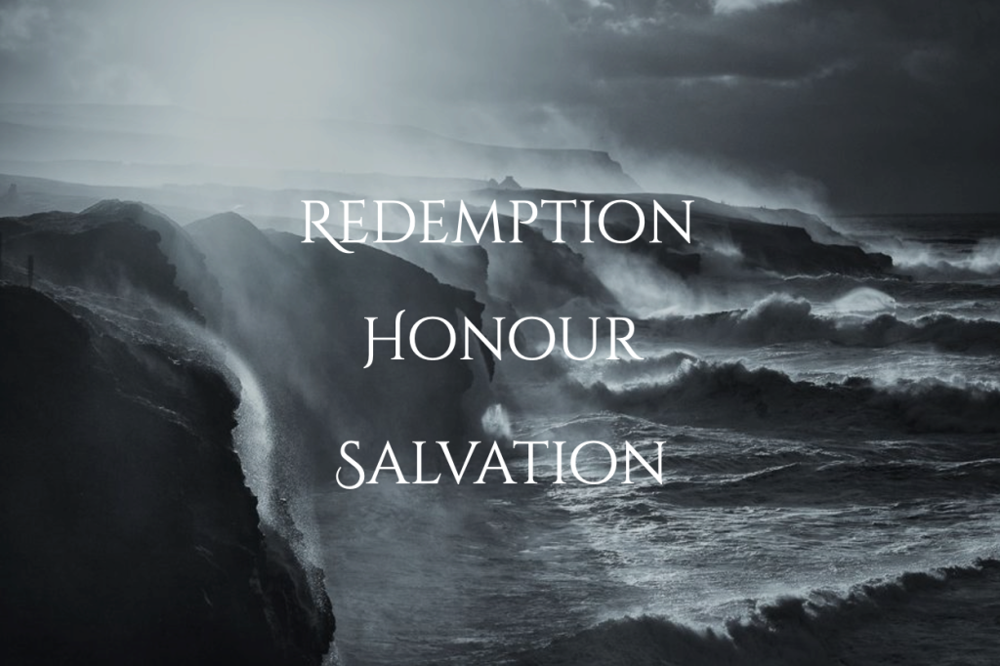Credit: George Karbus Photography

This story is really shaping up. I'm really excited to keep writing this with you. I would love to get some suggestions and feedback regarding the story.

Make sure you subscribe so you don’t miss out, because in the next post, we will be worldbuilding! We will craft a world that lives and breathes, inside, around, and beyond our story, while also providing a firm thematic base from which to explore our characters and their beliefs.

And finally, I'd like to thank [denamorado](https://www.freepik.com/free-photo/original-black-leather-texture-background_15340308.htm#query=black%20leather%20texture&position=0&from_view=keyword&track=ais) on Freepik for the background to the thumbnail image.

ETM Collins
