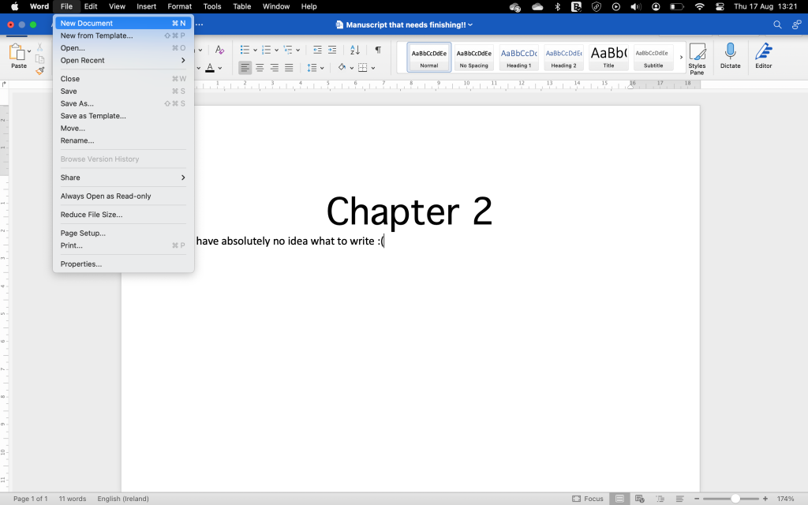
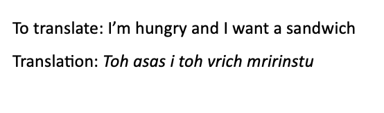
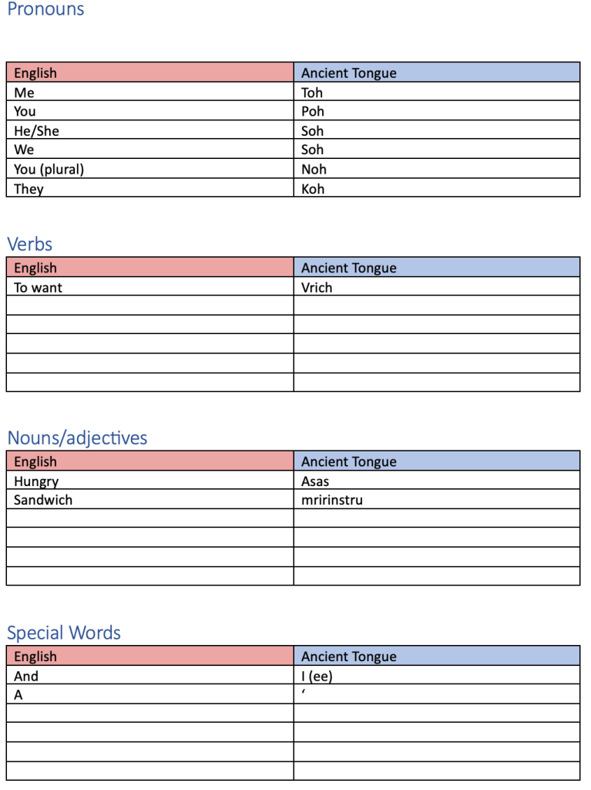
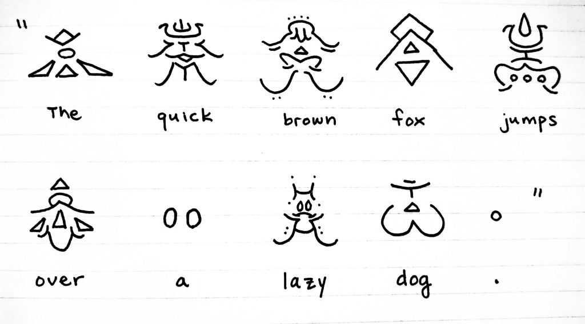
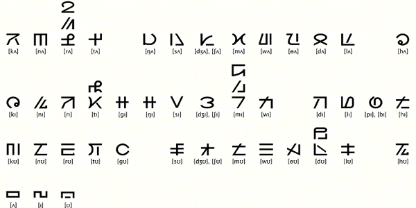
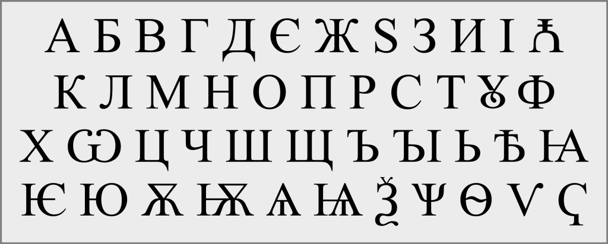
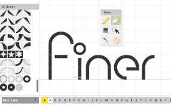
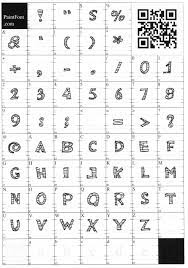
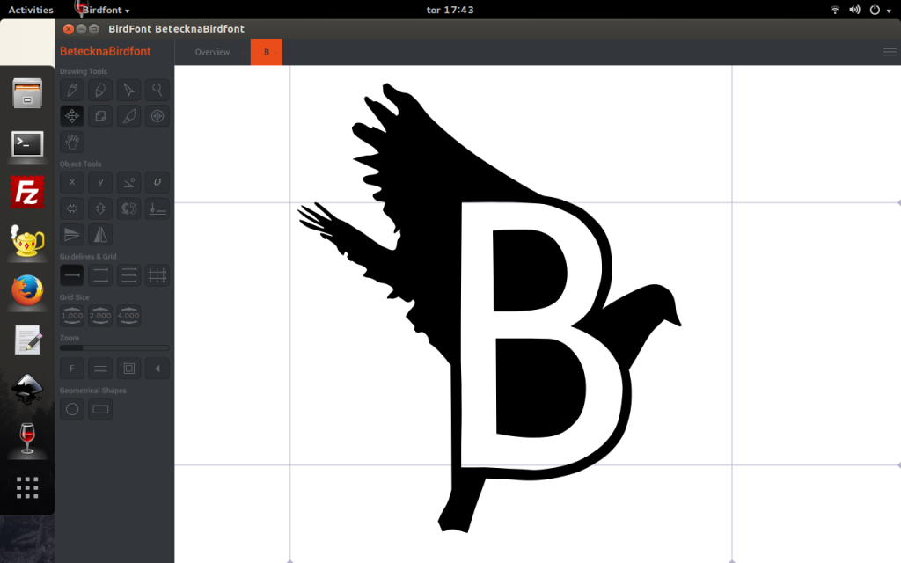
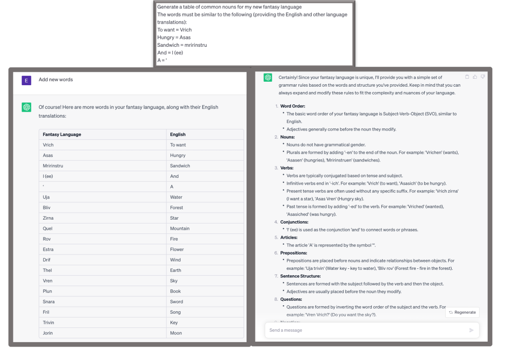

# On Worldbuilding: Creating a Language

Date: 2023-08-17 15:46:42

What fantasy story is complete without a completely unique language, complete with unique grammatical structures, unusual phonetics, a completely revolutionary writing system, and etymology for every word?

All. . .all of them. The answer is all of them.

BUT

Fantasy languages are awesome and can be great to immerse your reader into your world, to name people and locations, and to add to the richness of your world.

So, if you, like me, feel crazy enough to make your very own language using this simple method. . .

Let’s get this show on the road!

bIQ'a' naQ 'oH Ha'DIbaH!"

Ivestragī's jiōragon bisa urnēptre va se geralbar!

Soh’halperah vrencha!

# The Dictionary

Make a nice text file, and make a nice table to go with this (it just makes selecting stuff easier later).

Now, I like to start with a vague idea of the grammatical structure.

Usually it’s easiest to stick with English grammar, but you can have fun with this. Are there different verb endings for different pronouns? Do your descriptions go ARTICLE-NOUN-ADJECTIVE (The boat big (el barco grande)) like Spanish or ARTICLE-ADJECTIVE-NOUN (the big boat) like English  or some weird NOUN-ARTICLE-ADJECTIVE (boat the big). Are your tenses dependent on verb endings or do you have a different verb that explains it?

Or do you throw grammar to the winds because no one actually speaks your language?

All valid approaches.

The next thing I do, after I have an idea of what sort of grammar I want to use is make my pronouns. For this language we’ll keep it simple, using the same word for I/me/my, but you can get as elaborate as you want, even including formal pronouns and the like.

Next, I would find the applications of the language that I want to use, and start adding the words as they’re needed, so that I have to put in the minimum amount of work, but the language stays consistent. So, if you need words on your crazy awesome magic portal, _just_ write those words, don't go make an entire Oxford Dictionary for it.

For example, I may want to write this in the Ancient Tongue, so here’s my method

I take the sentence, translate the words and position them according to my grammar.

Then I put those words into my dictionary like so:

Now, you can have certain rules your words need to follow and stuff, but that gets a little out of my depth, and honestly, it usually doesn’t matter much, unless your story revolves around the language. I just try to make the words sound a little weird and a little connected (e.g. the consonant-R words above (vrich and mririnstu)).

# The Writing System

Most writing systems use one of the following:

Credit: [u/just-a-melon](https://www.reddit.com/user/just-a-melon/)

**Logography:** Where symbols represent words. These symbols can combine to make bigger words, and can be related by similar words having similar appearances. Think Chinese.

Credit: [omniglot.com](https://www.omniglot.com/conscripts/torrnuq.htm)

**Syllabaries:** This is kind of like having an alphabet of syllables. For example, * might stand for ka and <> might stand for ee. Example : hiragana and katakana syllabaries used for Japanese

By ХЕРАЛДИКА СССС - Own work, CC BY-SA 4.0, https://commons.wikimedia.org/w/index.php?curid=70758593

**Alphabets:** If you’re reading this, you know what an alphabet is. Put all your language’s consonants and vowels here, or make them possible to make by combining certain letters e.g. t and h coming together to form th. You can have the same or different letters as English, with the same or different symbols for them. Be creative, as there are a lot of sounds in other languages not in English and vice versa.

There are also a few different things, like abjads, where there’s only syllables for consonants, or abugidas which I don’t really understand.

# Making a Font

There’s a lot of ways to do this, and that’s great, because it allows you to make your writing system a font that you can use in your writing (although it might look a little weird to people without the font installed).

You can do this manually by making files in software such as Procreate, or you can use specialised tools like [Birdfont](https://birdfont.org/), [FontForge](https://fontforge.github.io/en-US/) (where you can use images, I believe), [PaintFont](https://www.paintfont.com/), and [FontStruct](https://fontstruct.com/).

   

Now, not only will you have your phonetic words in your dictionary, but you can add your written words there too, making your language even deeper than before!

(Ignore the fact that I used wingdings instead of a custom font 🫣)

**Oh, and as a little bonus**

You know Chat-GPT, the crazy chatbot that took over the internet a couple months ago? (Well, not literally, despite some people saying it could)

Well, Chat-GPT can help you make your language. With a little bit of prompting it can generate word lists, grammar structures, and more.

Now, I don't love using this, as it can give results that don't feel very creative, and takes a lot of the coolness out of making your own language. BUT if you need some help with your grammar, or need to ask a question, you should use it. And if you absolutely NEED a whole language with thousands of words, it might be better than doing it manually.

* * *

Well, now you should be able to create your own fantasy language. I hope this post gives you the confidence you need to create your own languages, because they are such cool things in fantasy, so they're always great to see.

Anyway, that's all from me. If you enjoyed this most, make sure to leave a comment and subscribe so you don't miss out on more content like this!
