# Once There Were Dragons: A Worldbuilding Technique

Date: 2023-07-08 14:54:31

Today we’re going to talk about a worldbuilding trope that is insanely common and is used by so many authors, from J.R.R. Tolkien to Brandon Sanderson to Hidetaka Miyazaki. I like to call it “Once There Were Dragons”. It is seen throughout fantasy, from  _The Wheel of Time_ to  _The Legend of Zelda_. Continue reading to see what I mean and learn how you can include this in your own writing.

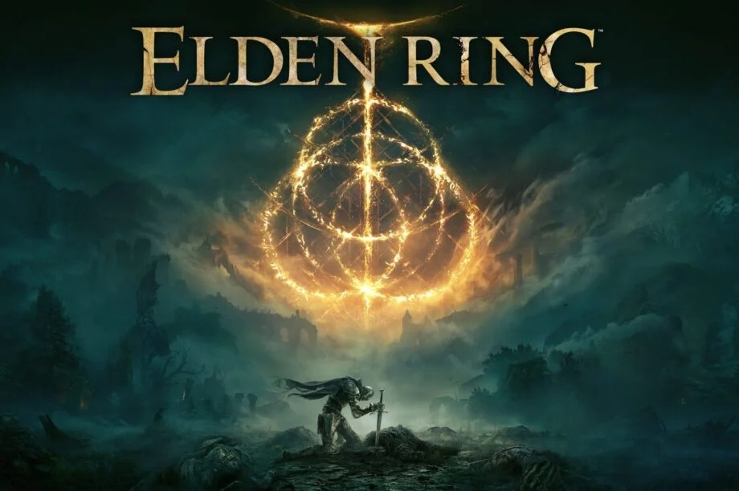 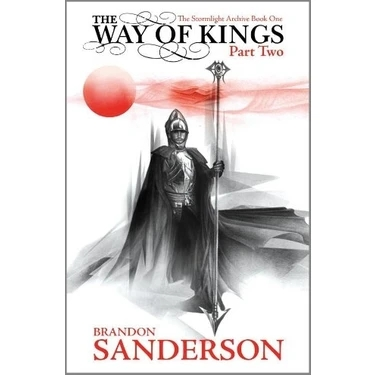 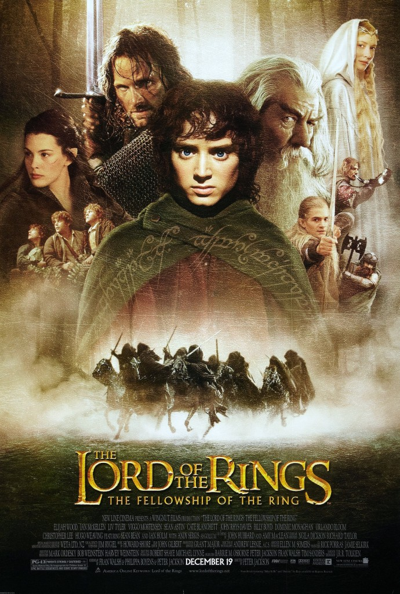 Books that Once Had Dragons

Alright, firstly I’d like to clear up some confusion with the name. The “Once There Were Dragons” trope doesn’t necessarily mean that there used to be dragons in this world. It’s more the idea that the fantasy world we’re exploring is actually the aftermath of a much more fantastical world. A world with more magic, some powerful beings, and yes, dragons.

I’ll give the obvious example of this to begin: _Lord of the Rings_. The events of these books take place in the Third Age of Middle Earth. It’s a breathtakingly magical journey through Tolkien’s painstakingly created fantasy world and laid the groundwork for many fantasy works in years to come. 

But despite the magic of Middle Earth and the inherently fantastical plot points and characters, it is quickly evident that Middle Earth is on the decline. Once there were far greater magical beings, once there were creatures that would make Sauron run for the hills, Once There Were Dragons.

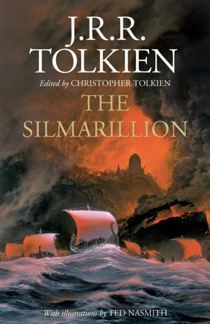Warning: Contains Dragons ^

But now the elves are leaving Middle Earth. Now few men remain from the lineage of Númenor. Now there are no more dragons (literally). It almost feels as though we are living in the aftermath of a greater fantasy story, and honestly, that’s good.

Hear me out. Walking through these ruins gives us a sense of intrigue, and if we learn from them, we are learning along with the characters, making us feel more part of the story than tagging along with the characters.

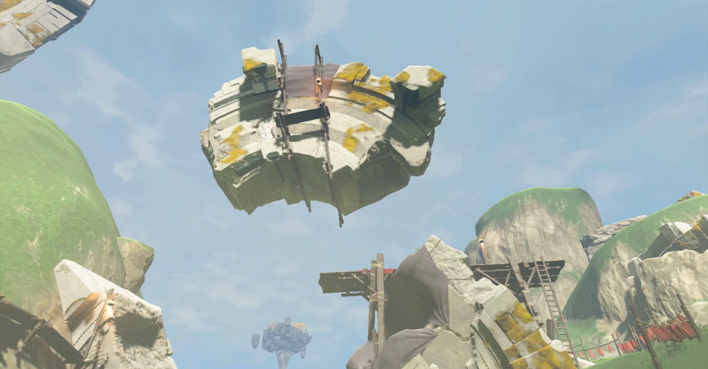

As well as this, there is just something profoundly epic about seeing the incredible marvels of aeons past, looming behind wooden villages. If everyone lived in a castle, it would lessen the impact of seeing them.

And, of course, it allows speculation. And God knows fandbases love that. I’ve seen people piece together a complex history from the small titbits we are given in _Elden Ring_ , a game that takes this concept to the extreme. In the game, the world has basically ended. The gods are dead, a war destroyed the land, and there’s just about no one left. But boy, we can see what used to be. 

From half-sunk Liurna to rot-blighted Caelid, to the night-abandoned city of Leyndell crushed by the body of a dead dragon, Crumbling Farum Azula, and the mountaintops strewn with the corpses of giants. It is awesome seeing what once was, and people like Vaatividya and The Tarnished Archaeologist and whole communities online piece together these fragments in an amazing culmination that shows the impact of the dragons of the past.

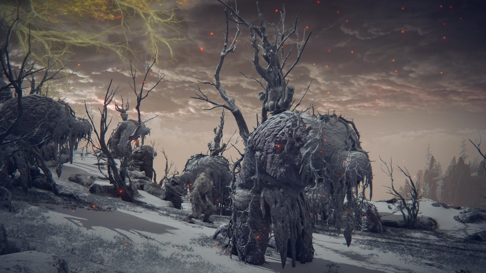 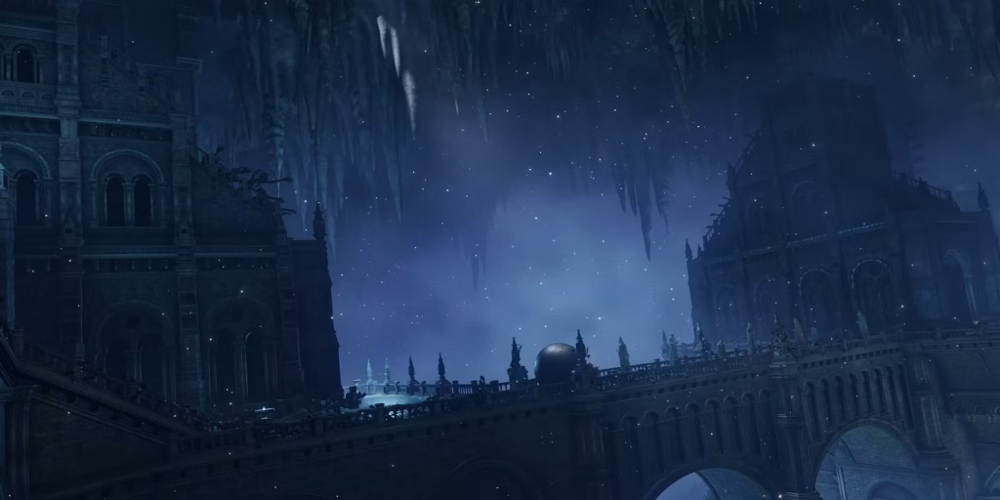 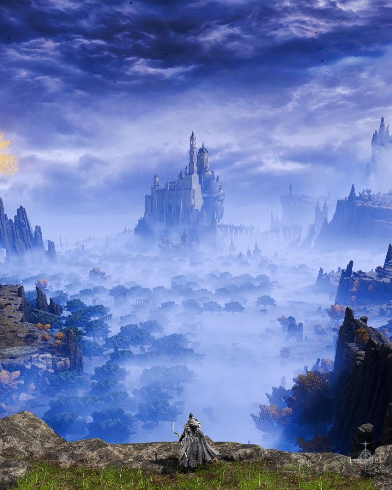 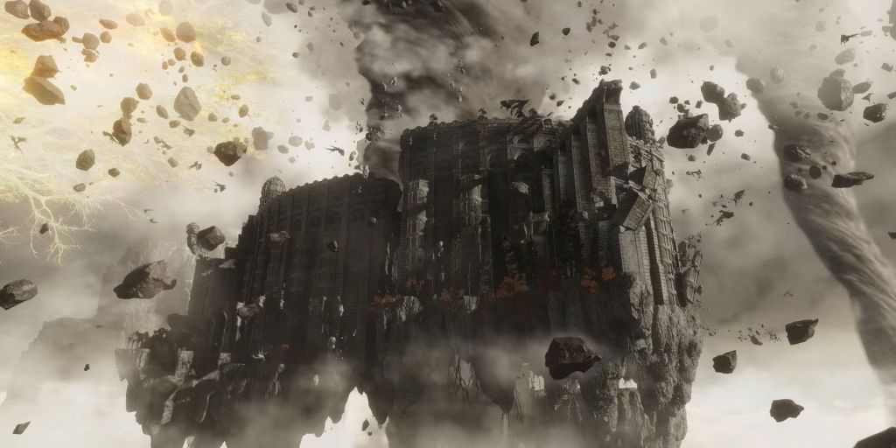 The Ruins of Elden Ring

But how can you use this in your own writing? I’m glad you asked. 

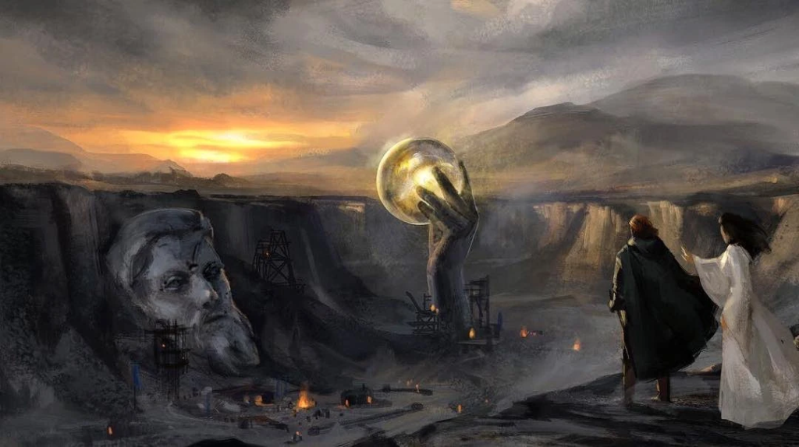

**Step 1** is to go nuts with your worldbuilding: Have colossal statues and crazy cities and floating islands and incredible technologies and the whole works.

**Step 2** is to create the builders of this incredible world: They can be ancient humans, as in _The Wheel of Time_ , some other species, as in _The Gentleman Bastards_  and _The Legend of Zelda: Tears of the Kingdom_ , or even gods, as (sort of) in _The Lord of the Rings_. 

Make them interesting and give them some incomprehensible powers or technology that allowed them to construct everything (powers that _can_  be used in your stories), or even just souped-up versions of what is available in the present-day.

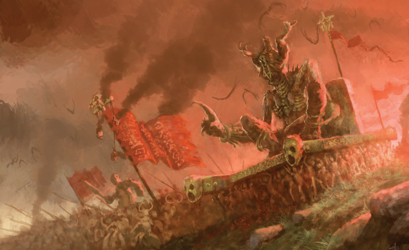

**Step 3** is to create some apocalyptic event, or in some cases, have these beings leave for unknown reasons. 

The mystique of what could have destroyed these seemingly omnipotent creators is so engaging to readers and has hooked me on many a story.

**Step 4** is to marvel at the fact that so many fantasy stories are post-apocalyptic stories a bit further on and with some magic sprinkled in. It’s pretty funny to think about, but if you want to skip this, you can go straight to writing.

Now that you have your “Dragons” and they have left, you’ve got an intriguing world. You can use the "Dragons" as your source of magic, or as the source of a MacGuffin device, or even just for an interesting backdrop, although I do love narratives that weave this kind of worldbuilding into the story being actively experienced by the characters.

Anyway, I hope you find this useful. If you did, consider subscribing for more writing advice and tips. Also, leave a comment with suggestions for further topics. Anyway, I have to go. My characters found an ancient statue and I have to make sure they don’t destroy their planet. Collins out!

ETM Collins
