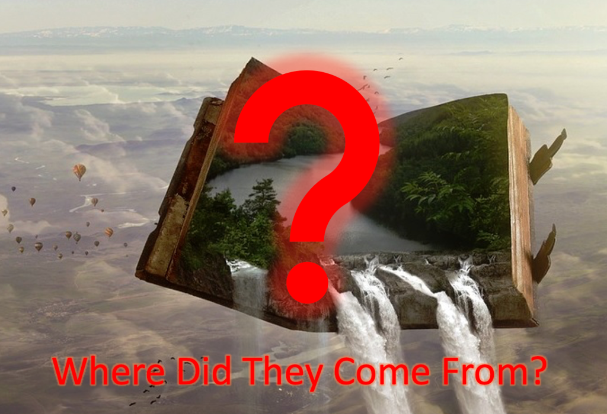

# The Case for Soft Magic Systems

Date: 2023-07-15 12:33:17

Now, don’t get me wrong. I LOVE a good hard magic system. The “aha!” moments and epic fight scenes are some of my favourite parts of books that utilise this form of magic. It can be a lot harder to have these kinds of things in soft magic systems, however soft magic systems have their advantages. In this post I will discuss the advantages of soft magic systems, how to mitigate their disadvantages, and urge you to consider using them amidst the ever more popular Sanderson-esque hard magic systems.

  

**What does Soft Magic do Better?**

1\. Well firstly, I believe soft magic feels more. . .magical than hard magic. I’ve talked about this in my previous blog post on [The Different Kinds of Magic System](https://etmcollins.com/2023/07/06/the-different-kinds-of-magic-systems/), but I’d like to reiterate it here.

Hard magic systems often feel epic and incredible, but as we know them better and can understand how every action works, they don’t feel as impossible, wondrous, or. . .magical, almost feeling like a medieval sci-fi. In fact, Tale Foundry has a great video about this that you can check out [here](https://www.google.com/url?sa=t&rct=j&q=&esrc=s&source=web&cd=&cad=rja&uact=8&ved=2ahUKEwjZxIi_y5CAAxUzREEAHewMBh0QtwJ6BAgXEAI&url=https%3A%2F%2Fwww.youtube.com%2Fwatch%3Fv%3DJeb_mSOgrVg&usg=AOvVaw2WoqlhJRu1yGbVaciUEkm-&opi=89978449).

One series that I feel illustrates this difference quite well is _The Wheel of Time_  by Robert Jordan. At the outset of the books, the magic used is very mysterious, and its practitioners, the Aes Sedai are even more so. However, as we read on, the magic is slowly explained, and the curtain is pulled back. It remains really cool, and I love the magic system, but it stops being wondrous and begins becoming a powerful tool, epic though it may be.

2\. Another thing I feel soft magic systems do better is worldbuilding. When worldbuilding with hard magic systems, you are often restricted to what you can have in your world. This is because if you have a meticulously exact magic system that is rigorously consistent, it can feel jarring to have these inexplicable floating islands, solid rainbows, or powerful fairies. It can be done, but at times the wonder can even be stripped out of these things.

On the other hand, soft magic systems allow you to go bonkers with your worldbuilding. Case in point: _The Lord of the Rings_  by JRR Tolkien. Gandalf’s an angel, Aragorn is ninety, Galadriel has a magic mirror-pond thing, the earth is (sort of) flat, there was a dragon bigger than mountains, trees fight in the Battle of Isengard. It’s great fun that would be difficult to have in more rigid magic systems.

  

**How to Mitigate the Problems**

1\. But I want to have epic fight scenes!

Don’t worry, you absolutely still can. There are just a couple rules that can make this easier:

  * Don’t have your POV characters be spellcasters, or if you do, make them pretty weak or limited. It is very disappointing as a reader to have a spellcaster pull something out of their back pocket that changes the battle. Either limit your spellcaster’s strength, which gives you a little wiggle room when tied in to emotions, or limit their abilities, because it’s alright if all they can do is make a blinding light and set stuff on fire.
  * Use magical artifacts! These can be awesome, and take a leaf out of hard magic’s book, making them generally consistent! Have swords that turn your enemies to ice. Have a helmet that makes you light as a feather. Have a cloak that turns you invisible (I wonder where that one came from 🤔). These can make up for the necessary lack of epic spellcasting prowess
  * Make the good guys not have magic but be badass. ‘Nough said I believe, but essentially, plop in some improbable skill and physical prowess for funsies
  * Give the bad guy powerful magic. Generally the villain having powerful magic is excusable. It makes them ominous and seemingly insurmountable. Just, maybe limit their ability to be defeated and then simply teleport away, unless there’s a good narrative reason.

2\. But I want to solve problems with magic!

You can do this, but you _do_  have to harden the magic around the problem. You could use a magical artifact from earlier, or an ability demonstrated earlier by magical creatures or demons roaming around, or even by introducing some location-specific magic, similar to how videogames often give dungeon-specific abilities to solve puzzles.

The thing you want to watch out for is having a wizard magic the problem away, or having the problem be too entrenched in your vague magic for people to understand. It’s generally pretty easy to tell when there’s a problem with this, but try some different things and see what works for you, just don’t lean on the magic too much, unless you want a hard magic system.

Anyway, that’s what I have to say on the topic of soft magic systems. I think they can be intriguing, mysterious, and wondrous when done well, and I’d love to see some new stories using them!

ETM Collins
