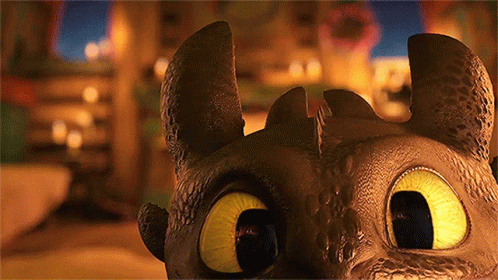
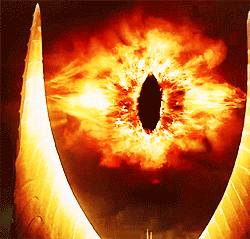
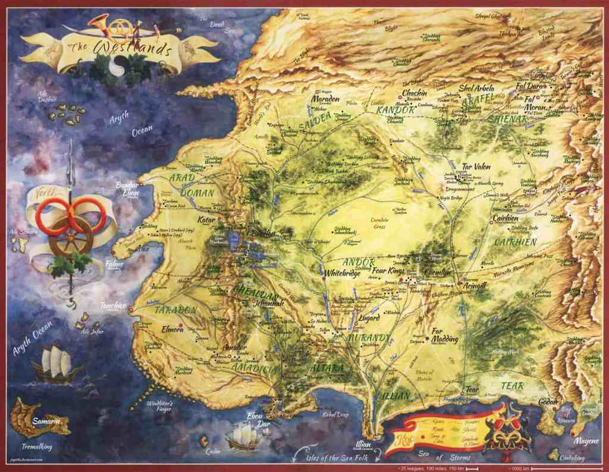
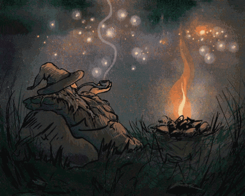
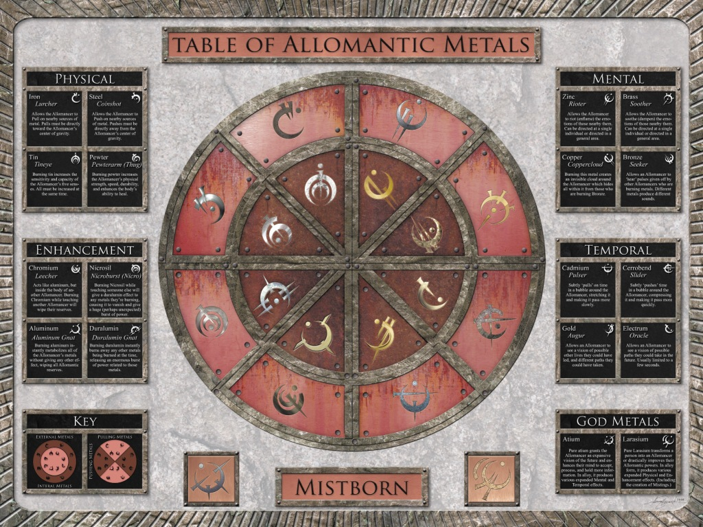
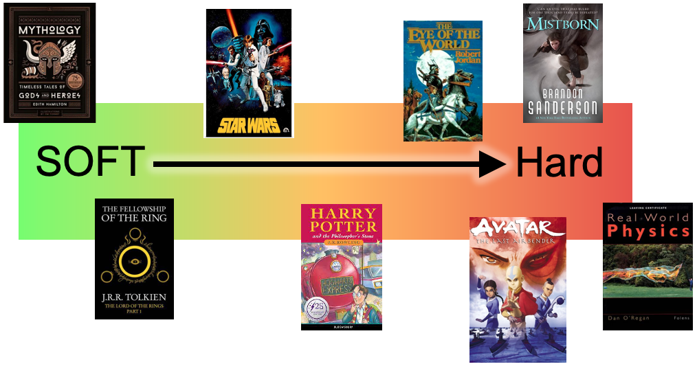

# The Different Kinds of Magic Systems

Date: 2023-07-06 16:37:32

There are so many amazing, distinctive features of fantasy writing. Other worlds, cultures, monsters, dark lords, DRAGONS! However, another thing that crops up in most fantasy stories is some form of magic system.

  

Magic systems are a pillar of the fantasy genre. They're found in works from "Lord of the Rings" to "Mistborn" to "Harry Potter" to "Avatar: The Last Airbender". All over the place, in a plethora of different incarnations. So what gives me the audacity to think to somehow classify such a diverse, unstandardised fantastical cornerstone?

Well, man had the audacity to start classifying nature, so ideas should be a piece of cake.

I'm not the first person to suggest this, but essentially, most magic systems fall into 2 main categories:

**Hard Magic Systems** and **Soft Magic Systems**

Soft Magic Systems

Soft Magic Systems are probably what most people think of when they hear the word "magic". This is the sort of magic practiced by the much-loved Gandalf or most characters from mythology. We don't know how these magic systems work, nor what their restrictions are, and we usually don't see the story from the perspective of magic-users. These magic systems usually serve to set up the plot and add flavour.

For example, in _The Lord of the Rings_ , we know next to nothing about the Rings of Power and the One Ring. All we know (mostly) is that if Sauron gets his hands on the One Ring, it will "spell disaster for all the free peoples of Middle Earth" or something. It's essentially a MacGuffin Device, a storytelling device we'll get into another time. We know the One Ring is magical. Doesn't matter how it was made or what it can do (although we do get some rules about how it works for Hobbits at least, turning them invisible, which _is_ sort of hard magic).

That is how the soft magic sets up the plot, however it also flavours the narrative. In mythology the characters often interact with mystical creatures or people that aren't explained or necessary for the plot, but serve to provide a sense of wonder in beholding this mystical world.

Both of these applications of soft magic are super, however, as we don't know much about the inner workings of the magic, it comes with certain restrictions. Namely, the author shouldn't solve problems using this magic, as that can feel like a cop-out. Also, the use of magic should be restricted, because if a spell is used once, people will wonder why it or a similar spell cannot be used later, to solve a problem.

Hard Magic Systems

Hard Magic Systems are becoming more and more popular these days. Often the example given for them is "Allomancy" in Brandon Sanderson's _Mistborn_ books. In contrast to soft magic, hard magic behaves with an inherent logic, one that never changes and that we, as the readers, usually know about. These magic systems are a lot more versatile than soft magic, as the author can solve problems with this system, since the reader understands its workings and won't feel cheated. If done well enough, this sort of problem-solving can even feel very rewarding to the reader if they've figured it out beforehand, or even if they haven't. However, this systemic approach to magic can somehow take the wonder out of it, although it does make room for some epic scenes and allow the magic to be used everywhere, so pick your poison, I suppose.

To give the example I mentioned in the previous paragraph, "Allomancy" is a great example of a hard magic system. "Allomancers" ingest a particular metal, which gives them a certain power, but uses up the metal. It's a very cause-and-effect approach to magic. For example, if an allomancer ingests and "burns" pewter, they get increased strength and resilience. The faster they burn the metal, the greater the effect.

I'm not even going to try to explain this ^

These magic systems can be great fun and it can be exciting for readers to unearth the different ways these rules can be adapted to various situations, along with the characters. However, it is crucial that the rules are explained early on, otherwise it can feel very frustrating.

In _King of Ash_ , I use a mostly hard magic system, although soft magic has a special place in my heart for the feeling of wonder and "true magic" that I get from it. Because, as fun as hard magic is, it does lose some of that wonder, replacing it with energy, excitement, and a system that is probably closer to science than classic magic.

Everything Else

I kind of lied when I said that hard and soft magic were the two main ways of doing magic systems. Sorry! 🤗 Most works don't use systems that are completely soft or completely hard. Even myths, with their inherently soft magic do have instances of hard magic, even if that is just saying: this fruit cures illness when eaten, this spear prevents you from sleeping, this monster can only kill you if you tell it your name. That kind of thing.

Conversely, even hard magic systems have (or appear to have) exceptions, and even when these are logically explained later, for the interval between introduction and explanation, the magic system softens a little.

Most magic exists on a spectrum between hard and soft magic.

Sure, _Harry Potter_ can add new spells or whatever it wants, but the ones that are introduced to the reader are at least consistent, even if they can't be leaned on _too_ heavily to solve problems.

Sure, _The Wheel of Time_ has a scientific approach to magic and we generally understand what's going on, but more complex "weavings" feel a little arbitrary.

Personally, I think that staying somewhere in the middle of hard and soft magic systems can often give you the most flexibility, although I generally prefer writing magic on the harder end.

I would love to hear feedback and opinions regarding this, and please share your favourite magic systems. And if you write, take part in this poll.
