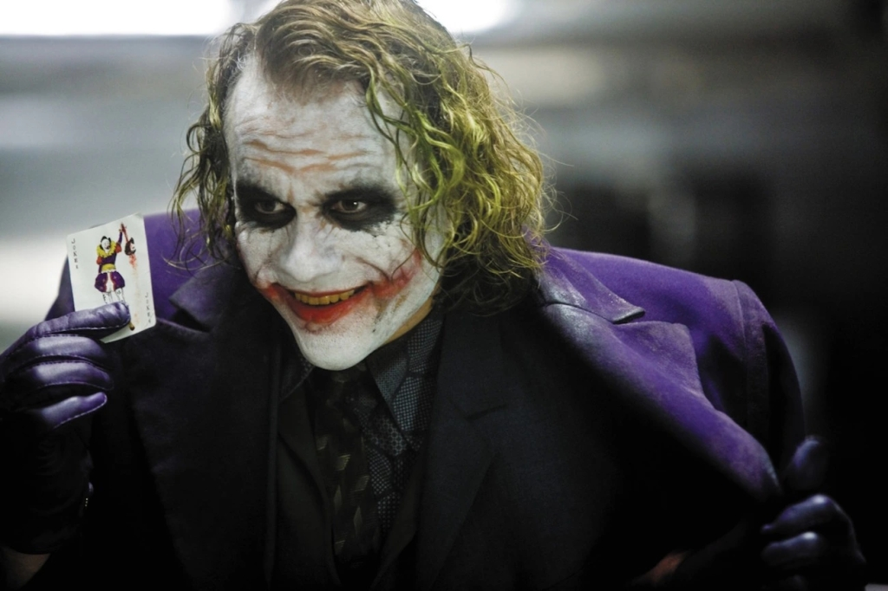
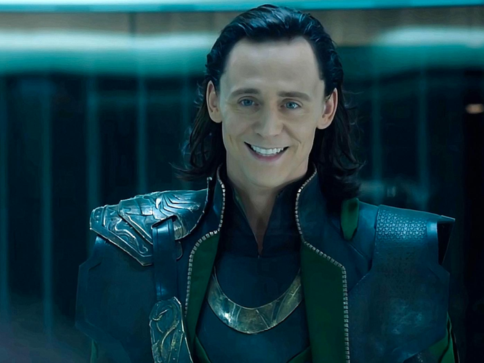
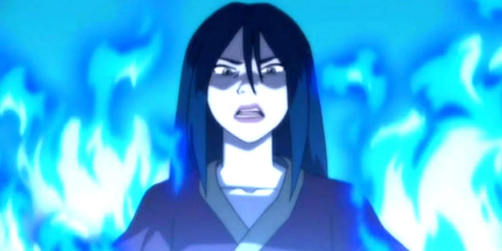

# Villaincraft: How to Make the Perfect Villain

Date: 2023-07-20 12:17:32

We’ve all been there. You’re trying to hire a villain for your story, but all the people you talk to are concerned with “laws” and “public image” and “losing their soul by sacrificing it to an eldritch god for untold cosmic power”. 

It can be a struggle to find a villain willing to participate in your narrative and after factoring everything in, you’re probably better off making your own villain.

Well, look no further than this guide!

Welcome, gentlefolk, ferals, and domesticated cryptids, to my guide on how to create memorable and effective villains for your story.

Identifying the Villain Category

A chimera-villain :)

There are a lot of different kinds of villains, but generally, they all fall into certain categories. Here, I have compiled a list that should cover most of the bases, although bear in mind that these categories can ABSOLUTELY be combined to create your own trope-chimera-villain.

  1. **Dark Lord** (Sauron in _The Lord of the Rings_ , The Lord Ruler in _Mistborn_ , The Dark One in _The Wheel of Time_)

 Art by Ari Ibarra 

Everyone loves a good Dark Lord. These guys represent pure evil (for most intents and purposes, I know the Lord Ruler wasn’t _evil_  evil). They generally act as a dark force, or powerful god commanding the armies of evil.

Usually, Dark Lords’ personalities aren’t examined, nor are they really considered “people” in the traditional sense. They’re generally just “the bad guy”.

These guys can be great for exploring the dichotomies of good and evil, or to be a driving force or instigator for your story’s events.

However, as these Dark Lords fail to inspire empathy, they are often accompanied by underlings that are more human. Think Saruman for Sauron or the Forsaken for The Dark One.

  2. **Evil Man** (Kingpin in _Spiderman Into The Spiderverse_ , The Grey King in _The Lies of Locke Lamora_ , Dolores Umbridge in _Harry Potter_)

Evil Men (not necessarily male) are characters you love to hate. Unlike Dark Lords, these characters are human, and often more nuanced than their absolute counterparts. However, make no mistake, while these characters might not be evil on an absolute level, from our protagonists’ point of view, they absolutely are.

In fact, these characters are usually hated more than Dark Lords because they tend to get a whole lot more personal and detestable with their actions.

Kingpin is human because his motivations are to get his wife and son back, but he kills Spiderman, which makes us hate him.

The Grey King commits similarly heinous acts in _The Lies of Locke Lamora  _(this is pretty far into the book, so I won’t spoil), which again, makes us hate him, despite his human motivations.

Umbridge. . .well, she’s obviously not a Dark Lord, but it wouldn’t be a stretch to claim she’s the most hated character in all the Harry Potter books.

The hallmark of these characters is that they do twisted things that hurt the protagonist personally, making us hate these “evil men”.

  3. **Schemers** (Loki in _The Avengers_ , Ruin in _Mistborn_  (although Ruin is also a bit of a Dark Lord), The Joker in _The Dark Knight_)

 

These villains plot and scheme, coming up with elaborate plans, misleading the protagonists and achieving their evil goals through clever, tricksy means.

These villains are a lot of fun, making readers think about solutions to problems and making them keep their eyes out for subterfuge.

There is nothing more simultaneously frustrating and awesome than seeing all the dominoes fall atop our heroes, or seeing the heroes win the day only to realise they have made a grave, grave mistake.

I really like Ruin as a schemer because, despite being a dark lord in terms of motivation, wanting to destroy the world, their schemes are far-reaching and every reveal is spine-chilling. Their hand has shaped everything throughout the trilogy, and it is so cool to think back and realise everything they have done.

  4. **Manipulators** (Hannibal Lecter from _Silence of the Lambs_ , Eurus Holmes from _Sherlock_ , Azula from _Avatar: The Last Airbender_  (although I’d also classify her as an “evil man”))

  

Okay, so the difference between a schemer and manipulator is a bit vague and arbitrary, but generally, manipulators are more about playing with the emotions and minds of their victims, rather than using elaborate, logical plots.

These characters can be close to the protagonists, and often frustrate and confuse the reader with the way they can manipulate and convince the protagonist or other characters to do things they otherwise wouldn’t.

I love these characters for the same reason I love schemers, as they’re very similar and very effective and memorable.

  5. **Grey Villains (** Miguel in _Spiderman: Across the Spiderverse_ , Zuko in _Avatar: The Last Airbender_ , Taravangian in _The Stormlight Archive_)

Grey villains are a pretty broad spectrum of villain, but anyway, essentially either the villain’s character is conflicted, confused, etc, like Zuko. 

Otherwise they might have good ideals, or a perspective we can understand, but the execution is wrong, like Miguel or Taravangian.

These kinds of villains challenge the reader’s ideas of morality. While the reader will generally conclude that despite the issue being nuanced, the hero is correct and the villain is wrong, the villain’s ideals or humanity will act as a foil for the hero’s own morals or methods.

Art by u/Barthollamew

Oftentimes the difference between a protagonist and a grey villain can be as small as execution. Perhaps you want people to stop burning fossil fuels, but eco-terrorism is not the way to go about that. Perhaps you are trying to save humanity, but if you kill innocents or throw them to the wolves, like Taravangian, you are still usually a villain.

The closeness between the hero and the grey villain is poignant enough to bring me onto my next villain archetype.

  6. **The Foil** (Whiplash in _Iron Man 2_ , Shou Tucker in _Fullmetal Alchemist_ , Darth Vader in _Star Wars_)

Now, while any villain, or any character in general, that we compare the hero to, is technically a foil, my idea of a Foil Villain is a little more specific.

My definition of the Foil is a character that represents what the hero could have been, if things had worked out just a little differently. If the main character had been put through different circumstances, if their decisions had differed just slightly, if the villain came to their aid instead of their mentor.

These kinds of villains are, in my opinion, the scariest. They hold a vicious light up to our characters, forcing us to examine them and to accept that in another life, they would be the villain. This can be terrifying, accepting that this idol could have been a devil if things had happened differently.

If the Starks had been screwed over rather than the Vankos, Tony Stark would be Whiplash. If given the same circumstances as his father, perhaps Luke would have fallen to the Dark Side.

 

_Spiderman: Across the Spiderverse_  hits this archetype on the nose at the end, when [SPOILERS FOR SPIDERMAN: ACROSS THE SPIDERVERSE] we see the Miles Morales in Earth-42 as the Prowler, effectively demonstrating how an identical character would be different because of circumstances.

* * *

_The villain archetypes: Dark Lord, Evil Man, Schemer, Manipulator, Grey Villain, Foil_

Okay, great! You have your villain archetypes. In order to craft a villain, take one of those archetypes or mix some together, and use that as your baseline.

Next, what you need are some motivations. Here, you’ve got the creative freedom to do whatever you want, however you should make these motivations somewhat realistic.

For Dark Lord types, evil/dominion can be motivation enough.

For the rest of the villains, something more specific is usually required. Perhaps they think they’re doing the right thing. Perhaps they’re going to terrible lengths to save someone they love. Perhaps they were neglected and outcast and want revenge. Perhaps they were saved by a villain and owe their loyalty to them. Have fun with this and you can often come up with something really cool and far more flavoursome than just evil for evil’s sake.

Now that you’ve got your archetype and your motivation, you can really go wild. Give your villain some personality, which can be anything at all. Give them some relationships, which can again be anything at all. Build their appearance, which we know from history can often be the coolest or most iconic part of a villain. Who can forget the eye of Sauron, Voldemort’s noseless face, or the Joker’s mad-clown appearance. I’ll be working on an article about character descriptions soon enough, so keep your eyes peeled for that.

Once you’ve got all of these together, you’ve got yourself a fully-fledged villain. With these tools in your arsenal, your villains can be powerful driving forces in your narrative, complex moral questions, or a mirror to hold up to your characters and have them realise that they are not so good and the villain is not so evil.

Anyway, that wraps things up for now. I can’t wait to see the villains that you create! If you’ve got any archetypes you think I’ve missed or any advice you’d like to share, leave a comment.

And if you’d like to see more of this content, make sure to subscribe so you don’t miss anything.

Anyway, I have to go make sure my mad scientist is cooking up a death-ray instead of experimenting with quantum computing again.

ETM Collins
