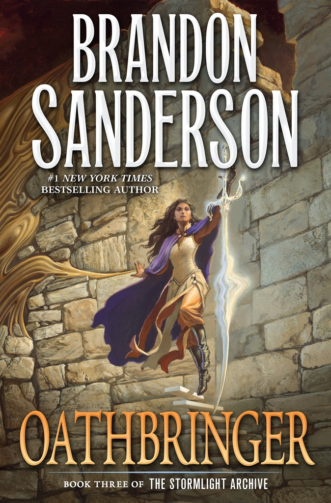

# Why Plot Twists Should Be Obvious

Date: 2023-08-21 20:35:38

The bad guy is your brother, the magic was fake, the idiot is the evil mastermind double-agent, and it all was a video-game inside a dream with writing so bad the main character breaks the fourth wall to point it out. Any of this sound familiar?

Plot twists can be great. . .and they can be less great. But there’s something all bad plot twists have in common. They come out of nowhere, crumpling an otherwise good plot with their terrible execution. But this doesn’t have to be the fate of your plot twist. All it means is that there’s one thing we need to bear in mind: THE TWIST SHOULD BE OBVIOUS.

Crazy hot-take, I’m aware. Sort of.

“But Eoghan, the point of the twist is that the reader doesn’t see is coming”. Well yes. . .and no. If a plot twist comes out of nowhere, or if it’s tagged on at the end as a cheap trick, it can devalue the story and leave us wanting.

Imagine if, at the end of the first _Harry Potter_  book, it all turned out to be a dream. Shocking? Yes. A good twist? **NO!**

Or what if, in _Star Wars_ , the main character is suddenly and inexplicably Palpatine’s granddaughter. Oh wait. . .

So clearly there’s a right way to do plot twists, and also a wrong way. So let’s see!

## Foreshadowing and Payoff

I think Brandon Sanderson does plot twists very well. In _The Final Empire_ , one of the main characters keeps avoiding questions about his plan to kill the villain. As it turns out, there was a reason for that. In _The Well of Ascension_ , the plot twist is outlined in the very first sentence! In _Oathbringer_. . .phew, you just have to read that to see, but basically, one of the main characters lost all the memories of his wife, and again, there’s a reason for that, and this ties into another plot twist later in the book.

  

As I see it, what’s necessary for a good plot twist is foreshadowing and payoff. And foreshadowing is where the obviousness comes in.

Now, you don’t have to make your plot twists  _too_ obvious. However, you do want it to be obvious in hindsight. For example , in  _Murder on the Orient Express_ [**SPOILERS**], all the evidence points to all of the passengers. We think that someone’s been planting evidence, but it turns out, in the end, that the evidence pointed to everyone because  _everyone_ committed the murder!

This is extremely satisfying as you thought of the answer and dismissed it out of hand. You _should_  have seen the twist coming. It was obvious, yet still somehow a surprise.

The foreshadowing here is the evidence and the payoff is an entertaining reveal that showcases the detective’s genius.

This is a pattern that can be seen throughout most brilliant plot twists.

In _The Well of Ascension_ , the foreshadowing is a line stated at the very start that makes its impact known much later in the book. And the payoff is that we can see the story is about to kick into high gear for the final book of the trilogy

 This same payoff reward can be said for other plot twists, such as the ending of _Across the Spiderverse_. Here, we are given a piece of evidence as early as the 1st movie, although it’s reiterated throughout the film, before we see at the end, that the story is going to get crazy in the third film.

## How to Foreshadow

From my reading of many works, there are three main ways to foreshadow a plot-twist while still having potential for surprise.

  1. State a fact at the start

Make this fact blatantly clear, blatantly obvious, impossible to miss, early in the text. Then forget about it, and don’t mention it until the twist. That way, the reader forgets about the fact, then remembers it when you bring it up at the twist and is kicking themselves for not having seen it sooner. 100% frustrated glee.

  2. Overshadow

Sure the dead cat was weird, but the whole family was just killed! Sure the mastermind is dodging questions, but there’s no way he’d keep pushing on with the plan without a clear endgame in mind, he’s just being mysterious. Sure that’s a weird detail to be on an alien planet, but we’re about to die!

Put in a question, make the reader think about it for a moment, then pull them away from it with something much more urgent. This works in a similar way to the 1st method and has a similar effect, although the audience can forgive themselves a little bit more. 50% frustrated, 100% glee

  3. Make it Unimportant

Keep referring back to a seemingly unimportant piece of information. A weird word-choice, an antique rifle, the time of arrival of the detective. Something that doesn’t seem to matter, but is repeated often enough that the reader thinks about it, then dismisses it, then thinks, then dismisses. This way, when you reveal its significance later, while it would honestly have been difficult for the audience to spot, the plot twist makes so much sense. 25% frustrated 100% glee.

## How to Payoff

This is a big one. If you’re going to have a plot twist, you have to make it worth it. The resulting story created by the plot twist must be an improvement on the story before it. This is how certain famous plot twists can get away without as much foreshadowing. For example, when Vader is revealed to be Luke’s father, it doesn’t make as much sense as we could wish for, but it heightens the emotional tension of the coming battle and raises the stakes, making for a much more interesting narrative.

Now, there’s a plethora of ways to make your plot-twist pay off, these are just some I thought would be cool to give as examples.

  1. Kick into High-Gear

We already talked about this one. It seems like everything is going to be okay, or seems like the story is going to go down a nice, but predictable path, but then the twist comes in and we realise we’re getting way more than we bargained for, and things are going to pay off a hell of a lot more.

Now, while this is easier to do with series (hence the Mistborn #2 and Spiderverse #2 examples) it is possible to do within a single narrative. In fact, I have done this in my own novel, _King of Ash_ , although I won’t spoil that here.

  2. Up the Emotions

The payoff of these kinds of twists is a heightened emotional tension in the narrative. Maybe it turns out the mentor is responsible for the character’s father’s death. Maybe the main character was unwittingly working for the bad guys and now needs to wrestle with the guilt and somehow side with enemies they vowed to kill. Whatever it is, it’s awesome.

  3. Awe

Make the plot-twist really, really cool. _Or_  make the person who discovers it _really really_  cool. This is simple, yet greatly effective, and I love plot-twists like these.

  4. Satisfaction

If your reader saw this plot-twist coming, they can feel satisfied with their powers of deduction. This is a great feeling, and is a great argument for what we’re talking about today, that plot-twists should be obvious!

## Conclusion

Hey, would you look at that! We’re at the end of the post-

Or are we?

. . .

Yeah, I’m joking. If there was going to be a twist in this post, I would have made it more obvious, although I don’t know how you’d do that in a blog post. Please comment your ideas below and subscribe so you don’t miss out on more writing content like this!

Also, I would love to hear your favourite plot-twists, so please comment those below, too!
