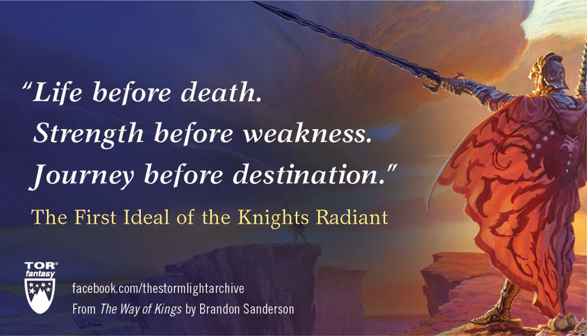
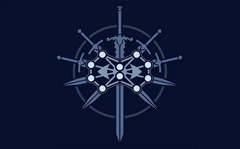

# The Brilliance of Stormlight's Ideals

Date: 2023-07-05 16:21:17

Hey, everyone! Yes, I can see the pun of using “brilliance” to describe anything to do with the Knight’s Radiant, but you have to believe it was unintentional in spite of my awareness of it.

_The Stormlight Archive_ by Brandon Sanderson is one of my favourite fantasy series. I could talk for hours about its unique worldbuilding, its realm of thought, its magic system, or even every Cosmere fan’s favourite “worldhopper”: Hoid. However, in this (spoiler-free) post, I am going to discuss one of the core tenets of Stormlight: the Ideals.

The First Ideal - Credit: [facebook.com/thestormlightarchive](http://facebook.com/thestormlightarchive)

This is the first ideal of the Knights Radiant. Without getting into too much detail, there are ten orders of the Knights Radiant, all with different values and thereby different ideals they have to swear. However, this is the ideal shared by all orders.

The main characters of Stormlight are, for the most part, Knights Radiant. Throughout the books we see them swear Ideals, advancing their bond with their Spren (a sort of spirit formed from ideas). Advancing their bond gives them new powers among other things, so the more oaths a Radiant has sworn, the more powerful they will be.

This is where the brilliance of the Ideals comes in. Each character must overcome a personal struggle in order to be able to say their Ideals. This means that a character’s power is _directly_  tied to their character growth. Other books try often try to match these things off, and succeed, but there is something magical about the direct, unbreakable link between character growth and power growth.

This creates a sort of tension as the character gets closer to being able to say their next Ideal, while the conflict also comes to a head. The resolution of this tension by saying the Ideal is always a spectacle and I am always entranced when it comes to it. In general, this tension feels familiar, but in a good way, and there have been times when I’ve had to put down the book before reaching the climax. This is because if I start reading the resolution and don’t get to finish it, it will stick in my mind and I won’t be able to think of anything else, a testament to Sanderson’s craft.

An example of such a scenario (completely fabricated by me, to avoid spoilers) would be something like this:

* * *

You’re a Radiant, being hunted along with your friends, by a demonic army. You run through the forest, but soon, you are surrounded and have to take shelter in a cave, where you will be boxed in. As you hide with your friends, the sounds of armoured marching grow louder as these demon-soldiers grow near.

The pounding of your heartbeat in your chest is the only sound that could compete with the knelling of the soldiers marching towards your hiding spot. Then, you see a gap in the rocks. You’re smaller than your friends. You could slip through, escape, but they would be trapped there. It would be the same as usual for you. You were a thief before all of this, always more slippery than your companions, leaving them to die as you fled the scene.

But these are your friends. Your bond with them has brought you out of your shell and they mean more to you than you care to admit. You’re family now, like it or not.

You step ahead of your friends as the soldiers round a corner and charge, snarling, roaring. They are so close now, you can feel their warmth, see the edges of their viscious blades. Your spren whispers to you:

“Say the words.”

“I will stand for love instead of fleeing for life,” you say, and are suddenly filled with great power.

With a yell, you throw spears of life, and the demon forces fall before you, dead. You have saved them.

* * *

Yeah, so that’s the sort of thing that would happen. Of course, it matters more when you’re reading the books, because you’ve had a thousand pages to get to know and care for the character in question and their friends. You’re egging them on all the way.

This way of merging emotions and actions in the Stormlight books is so effective it would almost feel like cheating if there weren’t three books worth of pages to set them up before hand. I hope you’ve learned something from this or that it has at least got you thinking about similar systems you could implement in your own works to mix the plot and character events into a cohesive structure. And please, if you know of any similar systems, let me know about them in the comments and I’ll be sure to have a look.

Symbol for _The Stormlight Archive_

ETM Collins
